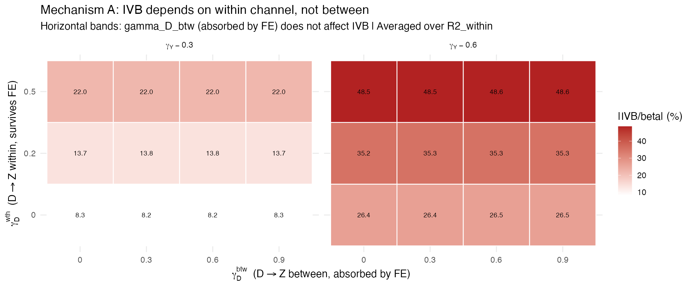
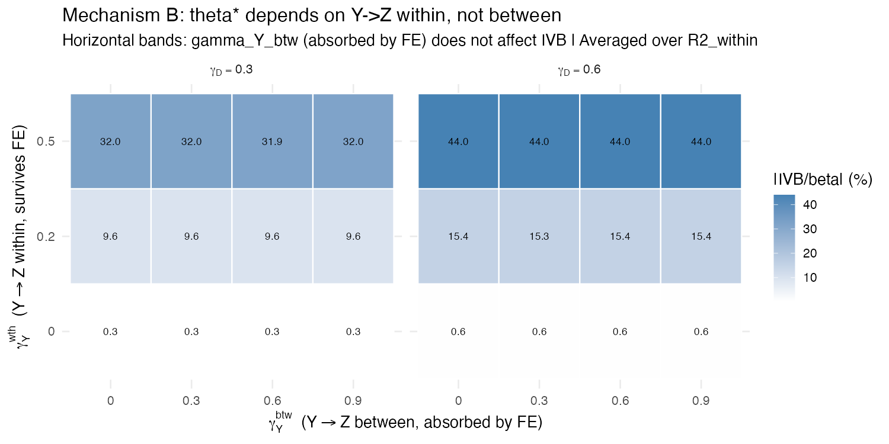

```{r setup, include=FALSE}
knitr::opts_chunk$set(
  echo = FALSE,
  message = FALSE,
  warning = FALSE,
  fig.align = "center",
  fig.pos = "H",
  cache = FALSE,
  dpi = 300
)

library(ggplot2)
library(dplyr)
library(tidyr)
library(kableExtra)
library(fixest)
library(data.table)

source("replication/ivb_utils.R")

theme_set(theme_minimal(base_size = 12))
```

# Introduction

Applied researchers using observational data face a fundamental challenge: which variables should be included as controls in a regression model? The answer to this question is decisive for causal identification, yet the discipline's standard practices offer surprisingly little guidance for getting it right. Two widely used heuristics---what we call *control checking* and *confounding checking*---instruct researchers to include variables that cause the outcome or that jointly cause the treatment and the outcome. While these rules are sensible in many settings, they share a critical blind spot: they do not assess whether a candidate control variable is a collider, a variable that is caused by both the treatment and the outcome (or by the treatment and an unobserved common cause of the outcome). Including a collider in a regression opens a backdoor path and biases the estimate of the causal effect \citep{pearl2009causality, elwert2014endogenous}.

The problem is especially acute in time-series cross-sectional (TSCS) research designs, which are ubiquitous in comparative politics and international relations \citep{beck1995what}. In TSCS settings, researchers routinely lag their control variables to avoid reverse causality. This seemingly prudent practice can, paradoxically, create collider bias. When a lagged control variable is itself caused by the outcome and by an unobserved variable that also affects the outcome, conditioning on it opens a spurious path---a phenomenon we term ``foreign collider bias.''

Directed Acyclic Graphs (DAGs) have become an increasingly recognized tool for diagnosing such problems \citep{pearl2009causality, imbens2020potential}. A growing literature in political science has begun to apply DAGs to improve causal identification \citep{montgomery2018conditioning, blackwell2018make}. DAGs provide a clear, qualitative answer to the question of *whether* including a particular variable introduces bias. However, they are silent on the equally important question of *how much* bias results. A researcher who discovers that a control variable is a collider still does not know the magnitude or even the direction of the bias without additional tools.

This paper fills that gap. We derive the **Included Variable Bias (IVB)** formula---a closed-form expression for the bias that arises when a collider variable is erroneously included in a regression model. The formula takes a remarkably simple form:
\begin{equation}
\text{IVB} = -\theta^{\star} \times \pi
\label{eq:ivb_main}
\end{equation}
where $\theta^{\star}$ is the coefficient on the collider in the misspecified (``long'') regression and $\pi$ is the coefficient on the treatment in an auxiliary regression of the collider on the treatment and legitimate controls.^[In the cross-sectional derivation, $\theta^{\star}$ corresponds to $\beta_2^{\star}$ and $\pi$ corresponds to $\phi_1$; we use the ADL notation throughout the paper as it is the more general form.] Both quantities are directly estimable from data, making the formula immediately operational for applied researchers.

The IVB formula mirrors the well-known Omitted Variable Bias (OVB) formula, but addresses the symmetrically opposite problem. Where OVB quantifies the cost of leaving out a relevant confounder, IVB quantifies the cost of putting in an irrelevant---or, more precisely, harmful---collider. We show that this result holds not only in standard cross-sectional regression but extends naturally to the Autoregressive Distributed Lag (ADL) models that are the workhorse of TSCS analysis. The extension relies on the Frisch--Waugh--Lovell (FWL) theorem \citep{frisch1933partial, lovell1963seasonal} and yields the same functional form, with the key quantities now partialled out by the dynamic controls (lagged dependent variables and lagged treatments).

Beyond the formula itself, we investigate the structural conditions under which IVB is large or small in panel settings with fixed effects. Using Monte Carlo simulations, we show that two-way fixed effects (TWFE) absorb the between-unit component of the treatment-collider and outcome-collider channels, leaving only the within-unit variation to drive the IVB. This result explains why IVB tends to be modest in typical TSCS applications: when the association between the treatment and a candidate collider is primarily cross-sectional (e.g., richer countries have better governance in levels), fixed effects remove this association, and the residual within-unit IVB is small. Additional mechanisms---binary treatments with few switchers inflating standard errors, and measurement error in controls attenuating the collider coefficient---reinforce this pattern.

We apply the IVB formula to six published studies in comparative politics and international political economy. For each study, we classify every control variable as a collider, confounder, mediator, or predetermined variable using DAG-based reasoning grounded in the published literature. Among the 14 theoretically motivated collider candidates across six studies, only one produces an IVB exceeding one standard error of the treatment effect: GDP per capita in \citet{rogowski_etal2022}, with $|\text{IVB}/\text{SE}| = 2.11$, corresponding to 58\% of $\hat\beta$. The median $|\text{IVB}/\text{SE}|$ across collider candidates is approximately 0.13---well within sampling noise. We examine two cases in detail: \citet{leipziger2024}, where GDP per capita as a collider attenuates the democratization effect by approximately 16\% of $\hat\beta$ but only half a standard error, and \citet{rogowski_etal2022}, where the same variable generates the only IVB exceeding one standard error but its collider status is causally ambiguous.

The remainder of this paper is organized as follows. Section~\ref{sec:control} reviews the standard heuristics for selecting control variables and identifies their limitations. Section~\ref{sec:dags} introduces DAGs and illustrates collider bias in a TSCS context using a running example from the civil war literature. Section~\ref{sec:ivb} presents the core theoretical contribution: the derivation of the IVB formula for cross-sectional and ADL models, including a result showing that replacing the treatment with a longer lag does not mechanically eliminate collider bias. Section~\ref{sec:ivb_magnitude} uses Monte Carlo simulations to identify the structural conditions that determine IVB magnitude in panel data. Section~\ref{sec:applications} applies the formula to six published studies. Section~\ref{sec:conclusion} concludes with recommendations for applied researchers.


# The Control Variable Problem \label{sec:control}

In observational studies, when using regression with a selection-on-observables strategy to identify a causal effect, including the right set of control variables is decisive. Which variables to include depends primarily on the researcher's scientific understanding of which variables are crucial to explain the phenomena of interest. A second criterion is that the model should be *identified*, meaning there is no bias in estimating the causal estimand of interest \citep{cinelli2021crash}. In practice, most scholars rely on informal heuristics to decide which controls to include. We review the two most common approaches below and argue that, while each has merit, neither is sufficient to prevent collider bias---and neither can quantify the resulting damage.

## Control Checking

A standard heuristic is to review the relevant literature to search for potential causal variables of the outcome of interest and include them in the regression as controls. A typical example of such a heuristic comes from a paper on foreign aid:

> ``As the previous literature on aid policy maintains, various other factors shape donor decisions about the allocation of aid resources, including other recipient characteristics and non-developmental donor goals. I include them as control [sic] to provide a fully specified model'' \citep[][p.~81]{dietrich2016donor}.

One can argue in favor of this approach by noting that a thorough literature review may identify variables whose inclusion decreases the unexplained variance in the dependent variable, thereby improving the precision of the estimate of the Average Causal Effect \citep{hahn2004functional, pearl2013linear, cinelli2021crash}. Unfortunately, this justification is not sufficient to decide whether a variable *should* be included as a control. As shown by \citet{cinelli2021crash}, it is quite possible to include a variable that decreases precision *and* induces bias, even if it is causally related to the outcome of interest. The control checking heuristic is agnostic about the causal structure linking the control to the treatment and outcome, and therefore cannot distinguish a helpful confounder from a harmful collider.

## Confounding Checking

A more targeted heuristic is to survey the literature specifically for potential *confounding* variables---those that cause both the outcome and the treatment. In econometric parlance, the goal is to avoid omitted variable bias by including all appropriate confounders. A typical example of this approach comes from the literature on political regime change and civil war:

> ``Our model does not attempt to present an inclusive theory of civil war, but level of democracy and political change do not provide a complete explanation. Therefore, we identify a number of control variables---Development, Ethnic Heterogeneity, Proximity of Independence, and International War in Country---whose omission might bias the results for the regime change variable'' \citep[][p.~37]{hegre2001toward}.

This heuristic is closer to the right intuition because it is explicitly focused on diminishing the primary source of bias in observational studies, namely, omitted variable bias. In DAG parlance, no omitted variable bias remains if the researcher blocks all backdoor paths by including all appropriate confounders. However---and this is a key point of this paper---this heuristic does not assess whether the researcher is inadvertently conditioning on a collider rather than a confounder. In the TSCS context, this shortcoming is particularly dangerous because the temporal structure of the data creates new opportunities for collider bias that are absent in pure cross-sections.

## The Quantification Gap

What about formal approaches that go beyond heuristics? Several alternatives exist. \citet{heckman2008econometric} argues that researchers should explicitly model the selection into treatment, which allows one to formally assess whether the causal effect is identified. While rigorous, this approach may be infeasible in practice due to tractability constraints or insufficient scientific knowledge about the selection process. Causal discovery algorithms \citep{spirtes2016causal, glymour2019review, duarte2021automated} offer another path, but they presuppose that all relevant variables have been measured---precisely the problem we need to solve in the first place.

A third approach, advocated by \citet{pearl2009causality} and employed in this paper, is to draw a Directed Acyclic Graph (DAG) to determine whether the causal effect is identified. The DAG approach allows the researcher to reason about missing controls, erroneously included ``bad controls,'' and even unobservable variables that set the limits of the study \citep{cinelli2021crash}.

Yet even the DAG approach, as typically used, has a limitation: it provides a \textit{qualitative} diagnosis---``this variable is a collider; do not condition on it''---but not a \textit{quantitative} one---``conditioning on this collider introduces a bias of magnitude $x$ in direction $d$.'' This paper addresses precisely this gap. By deriving a closed-form formula for the Included Variable Bias, we give applied researchers a tool that complements DAGs: the graph tells them *whether* there is a problem, and the formula tells them *how much* of a problem it is.

## Related Work on Collider Bias Quantification

Several prior contributions have derived formulas for collider-related bias in specific settings. \citet{greenland2003quantifying} quantified collider-stratification bias in linear structural equation models, showing that conditioning on a common effect can induce associations between otherwise independent causes. \citet{pearl2013linear} provided a systematic treatment of bias formulas in linear models using path analysis, including expressions for collider bias that follow from Wright's path-tracing rules. \citet{ding2015adjust} derived closed-form bias formulas for the M-bias (collider) configuration using linear structural equation models (LSEMs) and path analysis. Their sensitivity analysis demonstrated that pure M-Bias tends to be a ``higher-order'' effect---a product of four structural correlation coefficients---that is typically small unless all four correlations are simultaneously large. They further analyzed the ``Butterfly-Structure,'' in which a variable is simultaneously a collider and a confounder, showing that conditioning on it reduces bias in approximately 75\% of the feasible parameter space for that specific configuration. Most recently, \citet{jung2024mitigating} used the exact term ``included variable bias'' in the context of disparate impact estimation, focusing on the legal and fairness implications of conditioning on post-treatment variables.

To the best of our knowledge, no prior work has derived the IVB formula for autoregressive distributed lag models or applied it as a diagnostic tool in TSCS research. The fact that none of the six published studies we replicate in Section~\ref{sec:applications}---all appearing in leading journals---computed or reported the IVB for any of their control variables suggests that the tool, despite its algebraic simplicity, is not obvious to applied researchers.

Our paper builds on and extends this prior literature in several ways. First, whereas prior formulas are parameterized in terms of structural coefficients of the underlying LSEM---quantities that are typically unobserved and require full specification of the causal model---our FWL-based derivation expresses the bias in terms of regression coefficients that the applied researcher already has in hand ($\hat\theta^{\star}$ from the long regression and $\hat\pi$ from a simple auxiliary regression). This reparameterization is analogous to the contribution of \citet{cinelli2020making} for omitted variable bias: just as their sensitivity analysis recast the OVB in terms of partial $R^2$ values that researchers can benchmark, our formula recasts collider bias in terms of coefficients that researchers already report. The practical asymmetry is notable: whereas the OVB formula requires observing the omitted confounder---which, by definition, is typically unavailable---the IVB formula uses quantities that are already estimated, since the collider is by assumption included in the regression. Second, whereas prior formulas have been derived for cross-sectional or static settings, we extend the result to the Autoregressive Distributed Lag (ADL) models that dominate TSCS research in political science, and introduce the concept of ``foreign collider bias'' that arises from the temporal structure of panel data. Third, we distill the formula into a practical diagnostic recipe that requires only standard regression output, lowering the barrier to routine use by applied political scientists. Because the IVB formula is an algebraic identity of OLS, it holds exactly regardless of whether $D$ is continuous, binary, or discrete---unlike LSEM-based formulas, which require separate derivations for different variable types \citep{ding2015adjust}.


# DAGs and Collider Bias \label{sec:dags}

## Preliminaries

Directed Acyclic Graphs (DAGs) are part of an approach to causal inference first developed by \citet{wright1928tariff} and \citet{wright1934method}, and substantially advanced by the work of \citet{pearl2009causality} and collaborators \citep{pearl2018book}. DAGs have been applied in several domains, including epidemiology, computer science, and, more recently, political science \citep{imbens2020potential}.

All DAGs comprise three primary structures: chains, forks, and colliders (or inverted forks), shown in Figure~\ref{fig:three_structures}. Understanding these structures is essential for correct control variable selection.

\begin{figure}[H]
\centering
\begin{tikzpicture}[
    node distance=1.8cm,
    every node/.style={draw, circle, minimum size=1cm, font=\small},
    arr/.style={-{Stealth[length=2.5mm]}, thick}
]

% Collider (inverted fork)
\node (X0) at (0,4) {$X_0$};
\node (Y1) at (2,4) {$Y_1$};
\node (W) at (0,2.5) {$W$};
\draw[arr] (X0) -- (Y1);
\draw[arr] (W) -- (Y1);
\node[draw=none, font=\normalsize\bfseries] at (1, 1.5) {(a) Collider};

% Fork
\node (V3) at (5.5,4) {$V_3$};
\node (V1) at (4,2.5) {$V_1$};
\node (V2) at (7,2.5) {$V_2$};
\draw[arr] (V3) -- (V1);
\draw[arr] (V3) -- (V2);
\node[draw=none, font=\normalsize\bfseries] at (5.5, 1.5) {(b) Fork};

% Chain
\node (Z) at (10,4) {$Z$};
\node (X1) at (11.5,2.5) {$X_1$};
\node (Y2) at (13,4) {$Y_2$};
\draw[arr] (Z) -- (X1);
\draw[arr] (X1) -- (Y2);
\node[draw=none, font=\normalsize\bfseries] at (11.5, 1.5) {(c) Chain};

\end{tikzpicture}
\caption{The three elementary structures of DAGs: (a)~a collider or inverted fork, where $Y_1$ is a common effect of $X_0$ and $W$; (b)~a fork, where $V_3$ is a common cause of $V_1$ and $V_2$; and (c)~a chain, where $X_1$ is a mediator between $Z$ and $Y_2$.}
\label{fig:three_structures}
\end{figure}

In a **fork** (panel b), $V_3$ is a common cause of $V_1$ and $V_2$. If one is interested in the effect of $V_1$ on $V_2$, controlling for the common cause $V_3$ blocks the backdoor path and eliminates omitted variable bias. In a **chain** (panel c), $X_1$ mediates the effect of $Z$ on $Y_2$. If one is interested in the total effect, controlling for the mediator blocks the causal path and leads to underestimation. In a **collider** (panel a), $Y_1$ is a common effect of $X_0$ and $W$. A collider, unlike chains and forks, does not induce an association between its parent variables. However, conditioning on a collider (or on its descendants) *creates* a spurious association between its causes \citep{elwert2014endogenous, pearl2018book}.

The heuristic behind ``confounding checking'' can be understood as an attempt to block all backdoor paths by conditioning on forks. However, this heuristic says nothing about what happens when the candidate control is a collider. This is the problem we now illustrate in a TSCS context.

## A TSCS Application: Political Change and Civil War

Consider a typical setup in comparative politics. A researcher wants to estimate the causal effect of political regime change on civil war, as in \citet{hegre2001toward}. Suppose the only measured confounder is per capita income, which plausibly causes both political change and civil war \citep{blattman2010civil}. The researcher controls for per capita income to block the backdoor path.

In a TSCS setting, variables must be indexed by time. The researcher decides to lag both per capita income and political change to address reverse causality concerns. The resulting model corresponds to the temporal DAG in Figure~\ref{fig:dag_tscs}.

\begin{figure}[H]
\centering
\begin{tikzpicture}[
    node distance=2.5cm and 2.2cm,
    every node/.style={draw, rounded rectangle, minimum height=0.8cm, font=\small, align=center},
    arr/.style={-{Stealth[length=2.5mm]}, thick}
]

% Period t-1 and t nodes
\node (PC1) at (0, 3) {$PC_{t-1}$};
\node (PCt) at (5, 3) {$PC_t$};
\node (CWt) at (2.5, 1.5) {$CW_t$};
\node (CW1) at (7.5, 1.5) {$CW_{t+1}$};
\node (Inc1) at (0, 0) {$Inc_{t-1}$};
\node (Inct) at (5, 0) {$Inc_t$};

% Arrows
\draw[arr] (PC1) -- (CWt);
\draw[arr] (PC1) -- (PCt);
\draw[arr] (Inc1) -- (CWt);
\draw[arr] (Inc1) -- (PC1);
\draw[arr] (Inc1) -- (Inct);
\draw[arr] (CWt) -- (CW1);
\draw[arr] (PCt) -- (CW1);
\draw[arr] (Inct) -- (CW1);
\draw[arr] (Inct) -- (PCt);

\end{tikzpicture}
\caption{Temporal DAG for the effect of Political Change ($PC$) on Civil War ($CW$), with Per Capita Income ($Inc$) as a confounder. The temporal structure reveals that a lagged dependent variable ($CW_t$) is needed to block all backdoor paths to $CW_{t+1}$.}
\label{fig:dag_tscs}
\end{figure}

A key insight from this DAG is that the dynamic structure introduces backdoor paths through the lagged outcome ($CW_t$). To block these paths, the researcher must include $CW_t$ as a control---leading to a dynamic panel (ADL) specification. Without the lagged dependent variable, the causal effect is biased.

## Foreign Collider Bias

Now suppose the researcher, following the confounding checking heuristic, wants to add Democracy Level ($Dem$) as an additional control, as \citet{hegre2001toward} suggest. At first glance, this seems harmless: democracy plausibly affects both political change and civil war. However, a more careful DAG reveals a critical problem.

It is plausible that civil war *causes* changes in democracy levels (countries that experience civil war tend to become less democratic). If, in addition, there exist unobserved factors $U$ that affect both democracy levels and civil war---such as institutional quality, state capacity, or regional instability---then democracy level becomes a **collider**: it is a common effect of civil war and the unobserved $U$. Conditioning on it opens a backdoor path connecting $U$ to civil war through democracy level. Figure~\ref{fig:dag_collider} displays this structure.

\begin{figure}[H]
\centering
\begin{tikzpicture}[
    node distance=2.2cm and 2cm,
    every node/.style={draw, rounded rectangle, minimum height=0.8cm, font=\small, align=center},
    arr/.style={-{Stealth[length=2.5mm]}, thick},
    arrdash/.style={-{Stealth[length=2.5mm]}, thick, dashed}
]

% Nodes
\node (PC1) at (0, 4) {$PC_{t-1}$};
\node (PCt) at (5, 4) {$PC_t$};
\node (CWt) at (2.5, 2) {$CW_t$};
\node (CW1) at (7.5, 2) {$CW_{t+1}$};
\node (Inc1) at (0, 0) {$Inc_{t-1}$};
\node (Inct) at (5, 0) {$Inc_t$};
\node (U) at (10, 4) {$U$};
\node (Dem) at (10, 0) {$Dem_{t+1}$};

% Structural arrows
\draw[arr] (PC1) -- (CWt);
\draw[arr] (PC1) -- (PCt);
\draw[arr] (Inc1) -- (CWt);
\draw[arr] (Inc1) -- (PC1);
\draw[arr] (Inc1) -- (Inct);
\draw[arr] (CWt) -- (CW1);
\draw[arr] (PCt) -- (CW1);
\draw[arr] (Inct) -- (CW1);
\draw[arr] (Inct) -- (PCt);

% Collider arrows
\draw[arr, color=red!70!black] (CW1) -- (Dem);
\draw[arr, color=red!70!black] (U) -- (Dem);
\draw[arrdash, color=red!70!black] (U) -- (CW1);

\end{tikzpicture}
\caption{Complete DAG showing Democracy Level ($Dem_{t+1}$) as a collider. Civil War and an unobserved variable $U$ both cause Democracy Level. Conditioning on $Dem_{t+1}$ opens the collider $CW_{t+1} \to Dem_{t+1} \leftarrow U$, creating a spurious association between $CW_{t+1}$ and $U$. Because $U$ also causes $CW_{t+1}$ (dashed arrow), this biases the estimate of the effect of Political Change on Civil War. Red arrows highlight the collider structure.}
\label{fig:dag_collider}
\end{figure}

We call this \textit{foreign collider bias} because the collider problem arises from a causal pathway that the researcher discovers only by looking at the ``foreign'' literature on the determinants of democracy---a literature that is typically separate from the civil war literature motivating the original study. We use ``foreign'' to denote that the relevant causal knowledge---that $D$ causes $Z$ and $Y$ causes $Z$---often resides in literatures \textit{outside} the researcher's substantive domain, not in the sense of cross-national. The phenomenon is not limited to economic variables: in studies of voter turnout ($Y$) and campaign spending ($D$), a researcher controlling for media coverage ($Z$) faces foreign collider bias if both spending and turnout causally affect media coverage---a relationship documented in the communications literature rather than the electoral behavior literature. The standard heuristics for including controls review the literature on the \textit{outcome} and the \textit{treatment}, but they do not instruct the researcher to investigate whether the candidate control is itself caused by the treatment or outcome through an unobserved variable.

The concept of foreign collider bias has broad applicability in TSCS research. Consider a researcher studying the effect of democratization on ethnic inequality who controls for GDP per capita \citep{leipziger2024}. The ``domestic'' literature on ethnic inequality identifies GDP as a correlate of inequality and a plausible confounder. But the ``foreign'' literature on economic growth establishes that democracy causes GDP growth \citep{acemoglu_etal2019}, and that ethnic inequality causally reduces GDP \citep{grundler_link2024}. These two causal channels---$D \to Z$ and $Y \to Z$---make GDP per capita a collider as well as a confounder. Discovering this requires consulting the growth literature, not just the inequality literature. Similarly, in studies of public infrastructure and economic growth \citep{rogowski_etal2022}, GDP per capita is simultaneously the confounding variable that growth regressions must control for (conditional convergence) and a collider through the paper's core mechanism ($D \to Z$). Foreign collider bias is particularly insidious because researchers following best practices---reviewing the literature on potential confounders---may still miss it if they do not also investigate the determinants of each candidate control variable.

This example illustrates the power of DAGs: by making the causal structure explicit, they reveal that Democracy Level is a collider and that conditioning on it biases the regression. But the DAG alone does not tell us \textit{how much} bias results. For that, we need a formula.


# The Included Variable Bias Formula \label{sec:ivb}

In this section, we derive the Included Variable Bias (IVB) formula for the bias introduced by conditioning on a collider variable. We begin with the cross-sectional case, then compare IVB with the classical OVB formula, and finally extend the result to ADL models used in TSCS analysis.

## Cross-Section Derivation \label{sec:cs_derivation}

Consider the following setup. The true (``short'') model relating the outcome $y$ to the treatment $D$ is:
\begin{equation}
y = \beta_0 + \beta_1 D + e, \qquad \mathbb{E}[e \mid D] = 0
\label{eq:short}
\end{equation}
where $\beta_1$ is the true causal effect of $D$ on $y$.

Now suppose a researcher erroneously includes a collider variable $Z$ in the regression, estimating the ``long'' model:
\begin{equation}
y = \beta_0^{\star} + \beta_1^{\star} D + \beta_2^{\star} Z + e^{\star}
\label{eq:long}
\end{equation}
where the star superscript indicates coefficients from the misspecified model. Here $\mathbb{E}[e^{\star} \mid D] \neq 0$ in general, because conditioning on the collider $Z$ opens a spurious path.

The collider $Z$ is caused by both $D$ and $y$:
\begin{equation}
Z = \gamma_0 + \gamma_1 D + \gamma_2 y + u, \qquad \mathbb{E}[u \mid D] = 0, \; \mathbb{E}[u \mid y] = 0
\label{eq:collider_structural}
\end{equation}

The population coefficients from OLS satisfy:
\[
\beta_1 = \frac{\text{Cov}(D, y)}{\text{Var}(D)}, \qquad
\beta_1^{\star} = \frac{\text{Cov}(D, y) - \beta_2^{\star} \,\text{Cov}(D, Z)}{\text{Var}(D)}
\]

Subtracting, the bias in the estimated treatment effect is:
\begin{equation}
\text{Bias} = \beta_1^{\star} - \beta_1 = -\beta_2^{\star} \frac{\text{Cov}(D, Z)}{\text{Var}(D)}
\label{eq:bias_step1}
\end{equation}

To express this in terms of estimable quantities, substitute the true model \eqref{eq:short} into the collider equation \eqref{eq:collider_structural}:
\begin{align}
Z &= \gamma_0 + \gamma_1 D + \gamma_2 (\beta_0 + \beta_1 D + e) + u \nonumber \\
  &= \underbrace{(\gamma_0 + \gamma_2 \beta_0)}_{\phi_0} + \underbrace{(\gamma_1 + \gamma_2 \beta_1)}_{\phi_1} D + \underbrace{(\gamma_2 e + u)}_{\varepsilon}
\label{eq:reduced_form_Z}
\end{align}

The reduced-form coefficient $\phi_1$ is simply the population coefficient from regressing $Z$ on $D$:
\[
\phi_1 = \frac{\text{Cov}(D, Z)}{\text{Var}(D)}
\]

Substituting into \eqref{eq:bias_step1} yields the IVB formula:

\begin{proposition}[IVB, Cross-Section]
\label{prop:ivb_cs}
When a collider variable $Z$ is erroneously included in a regression of $y$ on $D$, the bias in the treatment effect estimate is:
\begin{equation}
\boxed{\textit{IVB} = \beta_1^{\star} - \beta_1 = -\beta_2^{\star} \times \phi_1}
\label{eq:ivb_cs}
\end{equation}
where $\beta_2^{\star}$ is the coefficient on $Z$ in the long regression \eqref{eq:long} and $\phi_1$ is the coefficient from regressing $Z$ on $D$.
\end{proposition}

Both $\beta_2^{\star}$ and $\phi_1$ are directly estimable from data: run the long regression to obtain $\hat{\beta}_2^{\star}$, and regress $Z$ on $D$ to obtain $\hat{\phi}_1$. No knowledge of the structural parameters $\gamma_1$ or $\gamma_2$ is needed.

We note that Proposition~\ref{prop:ivb_cs} follows algebraically from the Frisch--Waugh--Lovell theorem and the standard short-versus-long regression decomposition. Its simplicity, however, should not be mistaken for triviality. Prior work on collider bias quantification---including path-tracing formulas \citep{pearl2013linear}, structural equation model derivations \citep{greenland2003quantifying}, and the M-bias sensitivity analysis of \citet{ding2015adjust}---parameterizes the bias in terms of structural coefficients of the underlying data generating process, which are not directly observable. None of these contributions made the bridge to FWL or expressed the result in terms of regression coefficients that the applied researcher already has in hand. It is precisely the simplicity of the IVB formula that makes it (i)~immediately operational as a diagnostic tool, (ii)~extensible to the ADL models prevalent in TSCS research (Propositions~\ref{prop:ivb_adl}--\ref{prop:ivb_lag_sub}), and (iii)~a natural mirror of the OVB formula that applied researchers already use routinely.\footnote{The FWL-based derivation also extends straightforwardly beyond OLS. In two-stage least squares (2SLS) with a single instrument, the second stage is an OLS regression of $y$ on $\hat{D}$ and controls, so the IVB formula applies directly to the second-stage coefficients: $\text{IVB}_{\text{IV}} = -\hat\theta^{\star}_{\text{IV}} \times \hat\pi_{\text{IV}}$, where $\hat\pi_{\text{IV}}$ is the coefficient from regressing $Z$ on the instrumented treatment $\hat{D}$. For nonlinear models such as logistic regression, the linear probability model (LPM) provides a first-order approximation of the average marginal effect, and the IVB formula applied to the LPM coefficients approximates the collider bias in the AME. We leave formal treatment of these extensions to future work.}

## OVB versus IVB \label{sec:ovb_vs_ivb}

The IVB formula has a striking structural parallel with the classical Omitted Variable Bias formula. Table~\ref{tab:ovb_ivb} presents the comparison side by side.

\begin{table}[H]
\centering
\caption{Comparison of Omitted Variable Bias (OVB) and Included Variable Bias (IVB)}
\label{tab:ovb_ivb}
\begin{tabular}{lcc}
\toprule
 & \textbf{OVB} & \textbf{IVB} \\
\midrule
Problem & Omitting a confounder & Including a collider \\
Correct model & Long (includes confounder) & Short (excludes collider) \\
Wrong model & Short (omits confounder) & Long (includes collider) \\
Formula & $\delta_1 \times \gamma$ & $-\beta_2^{\star} \times \phi_1$ \\
Components & $\delta_1$: effect of omitted var in long reg & $\beta_2^{\star}$: effect of collider in long reg \\
 & $\gamma$: regression of omitted var on $D$ & $\phi_1$: regression of collider on $D$ \\
Sign of bias & $\text{sign}(\delta_1) \times \text{sign}(\gamma)$ & $-\text{sign}(\beta_2^{\star}) \times \text{sign}(\phi_1)$ \\
Estimable? & Only if confounder is observed & Yes, both components from data \\
\bottomrule
\end{tabular}
\end{table}

The key difference lies in the direction of the problem. With OVB, the researcher runs a short regression when the long regression is correct, and the bias equals the product of two regression coefficients involving the omitted variable. With IVB, the researcher runs a long regression when the short regression is correct, and the bias is the *negative* product of two analogous coefficients involving the included collider. The negative sign in the IVB formula arises because the mechanisms operate in opposite directions: OVB captures the effect of an omitted common cause channeled through the treatment-outcome relationship, while IVB captures the spurious association created by conditioning on a common effect.

A notable practical advantage of IVB is that its components are *always* estimable: the researcher has already included $Z$ in the regression (otherwise there would be no bias), so $\beta_2^{\star}$ is available, and $\phi_1$ comes from a simple auxiliary regression. By contrast, OVB requires observing the omitted variable---which, by definition, is often unavailable.

## Extension to ADL(1,0) via FWL \label{sec:adl10}

We now extend the IVB formula to the dynamic models used in TSCS analysis. Consider an ADL(1,0) specification. The correct (``short'') model is:
\begin{equation}
y_t = \alpha + \beta D_t + \rho y_{t-1} + e_t, \qquad \mathbb{E}[e_t \mid D_t, y_{t-1}] = 0
\label{eq:adl_short}
\end{equation}

The misspecified (``long'') model erroneously includes a collider $Z_t$:
\begin{equation}
y_t = \alpha^{\star} + \beta^{\star} D_t + \rho^{\star} y_{t-1} + \theta^{\star} Z_t + v_t
\label{eq:adl_long}
\end{equation}

Our goal is to express $\beta^{\star} - \beta$ in terms of estimable quantities. The key tool is the Frisch--Waugh--Lovell (FWL) theorem \citep{frisch1933partial, lovell1963seasonal}.

Define the set of ``legitimate'' controls $W_t = (1, y_{t-1})$ and let $\tilde{y}_t$, $\tilde{D}_t$, and $\tilde{Z}_t$ denote the residuals from projecting each variable on $W_t$. By FWL, the long regression \eqref{eq:adl_long} is equivalent to:
\[
\tilde{y}_t = \beta^{\star} \tilde{D}_t + \theta^{\star} \tilde{Z}_t + \tilde{v}_t
\]

In this bivariate residualized regression, the coefficient on $\tilde{D}_t$ satisfies:
\[
\beta^{\star} = \frac{\text{Cov}(\tilde{D}_t, \tilde{y}_t) - \theta^{\star}\,\text{Cov}(\tilde{D}_t, \tilde{Z}_t)}{\text{Var}(\tilde{D}_t)}
\]

The short model coefficient (also via FWL) is:
\[
\beta = \frac{\text{Cov}(\tilde{D}_t, \tilde{y}_t)}{\text{Var}(\tilde{D}_t)}
\]

Subtracting:
\[
\beta^{\star} - \beta = -\theta^{\star} \frac{\text{Cov}(\tilde{D}_t, \tilde{Z}_t)}{\text{Var}(\tilde{D}_t)}
\]

Now consider the auxiliary regression:
\begin{equation}
Z_t = a + \pi D_t + \lambda y_{t-1} + \eta_t
\label{eq:aux_adl}
\end{equation}

By the algebra of partial regression, $\pi = \text{Cov}(\tilde{D}_t, \tilde{Z}_t) / \text{Var}(\tilde{D}_t)$. Substituting:

\begin{proposition}[IVB, ADL(1,0)]
\label{prop:ivb_adl}
In an ADL(1,0) model, when a collider $Z_t$ is erroneously included, the bias in the treatment effect is:
\begin{equation}
\boxed{\textit{IVB}(\beta) = \beta^{\star} - \beta = -\theta^{\star} \times \pi}
\label{eq:ivb_adl}
\end{equation}
where $\theta^{\star}$ is the coefficient on $Z_t$ in the long regression \eqref{eq:adl_long} and $\pi$ is the coefficient on $D_t$ in the auxiliary regression \eqref{eq:aux_adl}.
\end{proposition}

The formula has the same structural form as the cross-sectional case. The only difference is that all quantities are now *partial* effects, conditioned on the legitimate controls $(1, y_{t-1})$. The dynamics enter through the residualization, but the final formula remains a simple product.

## Generalization to ADL($p$,$q$) \label{sec:adl_pq}

The result extends naturally to general ADL($p$,$q$) specifications. Consider the correct model:
\[
y_t = \alpha + \sum_{i=1}^{p} \rho_i y_{t-i} + \sum_{j=0}^{q} \beta_j D_{t-j} + e_t
\]

and the misspecified model including $Z_t$:
\[
y_t = \alpha^{\star} + \sum_{i=1}^{p} \rho_i^{\star} y_{t-i} + \sum_{j=0}^{q} \beta_j^{\star} D_{t-j} + \theta^{\star} Z_t + v_t
\]

Let $W_t$ denote the vector of all legitimate controls (constant, $y_{t-1}, \ldots, y_{t-p}$, and the relevant lags of $D$ other than $D_{t-j}$). The FWL argument carries through identically:

\begin{proposition}[IVB, ADL($p$,$q$)]
\label{prop:ivb_adlpq}
For any coefficient $\beta_j$ in an ADL($p$,$q$) model, the bias from including a collider $Z_t$ is:
\begin{equation}
\boxed{\textit{IVB}(\beta_j) = \beta_j^{\star} - \beta_j = -\theta^{\star} \times \pi_j}
\label{eq:ivb_adlpq}
\end{equation}
where $\pi_j$ is the coefficient on $D_{t-j}$ in the auxiliary regression $Z_t = a + \pi_j D_{t-j} + W_t'\delta + \eta_t$.
\end{proposition}

The generality of this result is noteworthy. Regardless of the number of lags in the outcome or the treatment, the IVB for any coefficient $\beta_j$ is always the negative product of two estimable quantities: the collider coefficient $\theta^{\star}$ in the long model, and the partial association $\pi_j$ between the treatment at lag $j$ and the collider, controlling for all other legitimate regressors.

An important practical observation is that while the *form* of the bias is simple, the *magnitude* can vary substantially depending on the dynamics. When the treatment $D_t$ is highly predictable from lags, the residualized treatment $\tilde{D}_t$ has little variation, and $\pi$ can become unstable. When $Z_t$ is a post-treatment variable that responds to $y$ or to correlated shocks, both $\theta^{\star} \neq 0$ and $\pi \neq 0$ tend to arise mechanically.

## Interaction with Nickell Bias \label{sec:nickell}

A further consideration arises in panels with unit fixed effects and short time dimensions. In such settings, the OLS estimates of ADL coefficients suffer from Nickell bias \citep{nickell1981biases}, which arises because the within-transformation creates a mechanical correlation between the demeaned lagged dependent variable $\tilde{y}_{i,t-1} = y_{i,t-1} - \bar{y}_i$ and the demeaned error term $\tilde{e}_{it} = e_{it} - \bar{e}_i$. The bias is of order $O(1/T)$: it can be severe when the time dimension is short (e.g., $T < 10$) but becomes negligible as $T$ grows \citep{judson_owen1999}.

Because the IVB formula is an algebraic identity---it decomposes the finite-sample difference between two nested OLS regressions---it remains exactly valid even in the presence of Nickell bias. The identity $\hat{\beta}^{\star} - \hat{\beta} = -\hat{\theta}^{\star} \times \hat{\pi}$ holds by construction whenever both regressions are estimated by OLS on the same sample. However, the \textit{causal interpretation} of the components changes. In a panel with short $T$ and unit fixed effects, both $\hat{\theta}^{\star}$ and $\hat{\pi}$ reflect a mixture of the true collider relationship and the dynamic bias introduced by the within-transformation. The IVB diagnostic therefore captures collider bias \textit{within the OLS/FE framework as estimated}, not within an idealized framework free of dynamic panel bias.

To build intuition, consider how the contamination operates. In an ADL model with unit fixed effects, the coefficient on the lagged dependent variable $y_{i,t-1}$ is biased downward (toward zero) when $T$ is small \citep{nickell1981biases}. This downward bias on the autoregressive parameter propagates to the other coefficients in the model, because the misestimated persistence of $y$ distorts the partial correlations among all regressors. In particular, the coefficient $\hat{\theta}^{\star}$ on the candidate collider $Z$ in the long model absorbs some of the ``missing'' persistence of $y$, and the auxiliary-regression coefficient $\hat{\pi}$ is similarly distorted whenever $Z$ co-moves with the lagged outcome. The net effect on the IVB product $-\hat{\theta}^{\star} \hat{\pi}$ is ambiguous in sign and depends on the specific DGP, but it is bounded by $O(1/T)$ just as the underlying Nickell bias is. Simulation evidence in \citet{judson_owen1999} suggests that the distortion becomes practically negligible once $T$ exceeds 20--30 periods.

The practical implication is straightforward. In panels with long time series ($T \geq 20$--$30$), the Nickell bias is small relative to sampling variability, and the IVB components can be interpreted as reflecting primarily the collider structure. In panels with short $T$ (a common situation in comparative politics, where $T$ may be 5--15 periods), researchers should be aware that the IVB estimate conflates collider bias with dynamic panel bias. In such settings, bias-corrected estimators \citep{arellano_bond1991} or the half-panel jackknife may be needed before the IVB components can be given a purely collider-bias interpretation. Importantly, the \textit{direction} of the IVB is less affected by Nickell bias than its \textit{magnitude}: the sign of the product $-\hat{\theta}^{\star} \hat{\pi}$ tends to be informative about the direction of collider bias even when the magnitudes are contaminated by dynamic panel bias.

## Lagging the Treatment Is Not a Mechanical Cure \label{sec:lag_not_cure}

Applied work sometimes replaces a contemporaneous treatment $D_t$ with a longer lag (e.g., $D_{t-3}$) under the intuition that this should make collider bias less likely. The IVB decomposition clarifies that this is not true in general.

\begin{proposition}[Lag Substitution Without Lagged Outcome]
\label{prop:ivb_lag_sub}
Consider a model without lagged dependent variables. For any target lag $k \geq 0$, define:
\[
y_t = \alpha + \beta_k D_{t-k} + W_t'\gamma + e_t
\]
as the correct (short) model, and
\[
y_t = \alpha^{\star} + \beta_k^{\star} D_{t-k} + W_t'\gamma^{\star} + \theta^{\star} Z_t + v_t
\]
as the long model including collider $Z_t$. Then:
\[
\beta_k^{\star} - \beta_k = -\theta^{\star}\pi_k,
\]
where $\pi_k$ is the coefficient on $D_{t-k}$ in
\[
Z_t = a + \pi_k D_{t-k} + W_t'\delta + \eta_t.
\]

Now suppose the collider process is:
\[
Z_t = a + \pi_0 D_t + \pi_1 D_{t-1} + W_t'\delta + \eta_t.
\]
Let $\widetilde{X}$ denote residualization of $X$ on $W_t$, and define
\[
\widetilde{D}_{t-\ell} = \omega_{\ell k}\widetilde{D}_{t-k} + r_{\ell t}, \qquad \ell \in \{0,1\},
\]
with $\mathrm{Cov}(\widetilde{D}_{t-k}, r_{\ell t}) = 0$. Then:
\[
\pi_k = \pi_0 \omega_{0k} + \pi_1 \omega_{1k},
\]
so that
\begin{equation}
\beta_k^{\star} - \beta_k = -\theta^{\star}\left(\pi_0 \omega_{0k} + \pi_1 \omega_{1k}\right).
\label{eq:ivb_lag_sub}
\end{equation}
In particular, for $k=3$:
\[
\beta_3^{\star} - \beta_3 = -\theta^{\star}\left(\pi_0 \omega_{03} + \pi_1 \omega_{13}\right).
\]
\end{proposition}

Equation~\eqref{eq:ivb_lag_sub} shows that moving from $D_{t-1}$ to $D_{t-3}$ does not mechanically eliminate IVB. Bias disappears only in special cases, such as $\theta^{\star}=0$, $\omega_{03}=\omega_{13}=0$, or knife-edge cancellation $\pi_0 \omega_{03} + \pi_1 \omega_{13}=0$.

More generally, if
\[
Z_t = a + \sum_{\ell=0}^{L}\pi_{\ell} D_{t-\ell} + W_t'\delta + \eta_t,
\]
then for any target lag $k$:
\[
\pi_k = \sum_{\ell=0}^{L}\pi_{\ell}\omega_{\ell k}
\quad\Rightarrow\quad
\beta_k^{\star} - \beta_k = -\theta^{\star}\sum_{\ell=0}^{L}\pi_{\ell}\omega_{\ell k}.
\]
Hence, longer lags can attenuate IVB when the $\omega_{\ell k}$ terms are small, but they do not guarantee zero collider bias.

## A Practical Recipe \label{sec:recipe}

We summarize the IVB formula as a simple diagnostic procedure for the applied researcher:

\begin{enumerate}
\item[\textbf{Step 0.}] \textbf{Establish causal status.} Using a DAG or substantive domain expertise, establish that $Z$ is plausibly a collider---a variable caused by both $D$ and $Y$ (or by $D$ and an unobserved common cause of $Y$). If $Z$ is instead a confounder, the IVB formula quantifies omitted variable bias in the short model, and the \textit{long} model is correctly specified. The steps below are informative as a collider diagnostic only if $Z$'s collider status has been established through causal reasoning, not statistical testing. In Section~\ref{sec:applications}, we illustrate how to combine literature review with DAG reasoning to assess collider plausibility before computing the IVB.

\item \textbf{Run the long regression.} Estimate the model that includes the suspected collider $Z$:
\[
y = \ldots + \theta^{\star} Z + \text{other controls} + v
\]
Record $\hat{\theta}^{\star}$.

\item \textbf{Run the auxiliary regression.} Regress the suspected collider on the treatment and all legitimate controls:
\[
Z = \ldots + \pi D + \text{same controls as in step 1, minus } Z + \eta
\]
Record $\hat{\pi}$.

\item \textbf{Compute the bias.} The estimated IVB is:
\[
\widehat{\text{IVB}} = -\hat{\theta}^{\star} \times \hat{\pi}
\]
\end{enumerate}

If $|\widehat{\text{IVB}}|$ is large relative to the estimated treatment effect, the researcher has strong reason to exclude the collider from the specification. The sign of the IVB indicates the *direction* of the bias: whether including the collider attenuates or amplifies the treatment effect.

## Interpretation Caveats \label{sec:caveats}

An important caveat concerns the interpretation of the IVB formula. The decomposition $\beta_1^{\star} - \beta_1 = -\beta_2^{\star} \times \phi_1$ is an \textbf{algebraic identity}: it holds whenever the short and long regressions are nested, regardless of the causal role of $Z$. The formula quantifies the \textit{arithmetic} difference between two nested specifications; it does not, by itself, determine which specification is causally correct. The product $\beta_2^{\star} \times \phi_1$ will be non-zero whenever $Z$ is correlated with both $D$ and $y$ conditional on other controls---a condition satisfied not only when $Z$ is a collider, but also when $Z$ is a confounder or a mediator.

The three cases lead to fundamentally different conclusions:

\begin{itemize}
\item \textbf{$Z$ is a collider.} Then the short regression is correctly specified, the IVB formula gives the bias introduced by including $Z$, and the researcher should exclude $Z$. This is the case the formula is designed to diagnose.

\item \textbf{$Z$ is a confounder.} Then the long regression is correctly specified, and the same algebraic decomposition gives the omitted variable bias in the short regression. In this case, excluding $Z$ \textit{introduces} bias rather than removing it. The formula is still informative---it tells the researcher how sensitive the treatment estimate is to including $Z$---but its sign is reversed: a large IVB is evidence that $Z$ is an important confounder, not that it is a harmful collider.

\item \textbf{$Z$ is a mediator.} Then $Z$ lies on the causal path from $D$ to $Y$, and neither the short nor the long regression may recover the desired causal estimand without further assumptions \citep{acharya_etal2016}. The IVB formula captures the difference between the total effect and the direct effect, but interpreting this difference requires clarity about whether the target estimand is the total or direct effect.
\end{itemize}

Only the DAG determines which case applies. The IVB formula complements DAGs but cannot substitute for them: the graph tells the researcher \textit{whether} $Z$ is a collider, and only then does the formula quantify how much damage including it causes. We illustrate this interplay in Section~\ref{sec:applications}, where we combine literature review with DAG reasoning to assess collider plausibility before computing the IVB. The Rogowski et al.\ application in particular shows that a large IVB does not automatically imply collider bias---it may instead reflect appropriate deconfounding.

Sufficient conditions for classifying $Z$ as a collider include: (i)~credible evidence from separate studies that $D$ causally affects $Z$ and $Y$ causally affects $Z$; (ii)~absence of evidence that $Z$ causally affects either $D$ or $Y$; and (iii)~the causal effect of $D$ on $Z$ and $Y$ on $Z$ operating through mechanisms that are not mediated by the other. When these conditions are not met---for instance, when $Z$ is simultaneously a confounder and a collider---the IVB formula still quantifies the arithmetic difference between specifications, but its causal interpretation requires additional assumptions (see \citealt{ding2015adjust} for the ``Butterfly-Structure'' case).

The empirically prevalent case in which $Z$ is simultaneously a collider and a confounder deserves particular attention. \citet{ding2015adjust} analyzed one such configuration---the ``Butterfly-Structure''---in cross-sectional LSEMs, finding that conditioning on $Z$ reduces net bias in approximately 75\% of the feasible parameter space. However, this result is specific to a single structural configuration with particular symmetry assumptions. In TSCS settings with fixed effects, the landscape is richer: FE absorbs between-unit confounding while leaving within-unit collider channels intact, potentially shifting the trade-off in ways that depend on the panel structure. A systematic FWL-based derivation of when collider bias dominates confounding bias under TWFE---yielding analytical results rather than relying solely on simulation---is a promising direction for future work that would extend both our framework and that of \citet{ding2015adjust} to the panel setting.


# When Does IVB Matter in Panel Data? \label{sec:ivb_magnitude}

The IVB formula tells a researcher *how much* bias results from including a specific collider. But a natural prior question is: under what structural conditions should we expect the IVB to be large or small? This question is especially relevant for TSCS research, where two-way fixed effects (TWFE) absorb unit-level and time-level variation, potentially shrinking the components of the IVB.

We use Monte Carlo simulations to identify four structural mechanisms that determine IVB magnitude in panel data with fixed effects. All simulations use $N = 200$ units, $T = 30$ periods, a true treatment effect $\beta = 1$, and 500 replications per scenario. We focus on the clean case ($\delta = 0$, no confounding through $Z$), so that any bias arises exclusively from the collider channel.

## Fixed Effects Absorb the Between-Unit Collider Channel \label{sec:mech_ab}


The IVB identity is:
$$
\text{IVB} = \hat\beta_{\text{long}} - \hat\beta_{\text{short}} = -\hat\theta^{\star} \times \hat\pi
$$
where $\hat\theta^{\star}$ is the coefficient on $Z$ in the long model and $\hat\pi$ is the coefficient on $D$ in the auxiliary regression $Z \sim D + \text{FE}$. We now show that TWFE absorbs the between-unit component of both $\hat\pi$ and $\hat\theta^{\star}$, leaving only within-unit variation to drive the IVB.

**Mechanism A: The $D \to Z$ channel.** Suppose the collider $Z$ depends on $D$ through both a between-unit channel (cross-sectional correlation in levels) and a within-unit channel (temporal co-movement):
$$
Z_{it} = \gamma_D^{\text{btw}} \mu_i^D + \gamma_D^{\text{wth}} (D_{it} - \mu_i^D) + \gamma_Y Y_{it} + \eta_i + \mu_t + \nu_{it}
$$
where $\mu_i^D = T^{-1}\sum_t D_{it}$ is the time-invariant unit-level component of $D$. After TWFE absorbs unit fixed effects, the term $\gamma_D^{\text{btw}} \mu_i^D$ is removed (it is collinear with $\eta_i$). The surviving first-stage coefficient is:
$$
\pi = \gamma_D^{\text{wth}} + \gamma_Y \beta
$$
which is independent of $\gamma_D^{\text{btw}}$. In other words, the between-unit association between $D$ and $Z$---no matter how strong---does not contribute to $\pi$ after fixed effects, and therefore does not contribute to the IVB.

**Mechanism B: The $Y \to Z$ channel.** An analogous argument applies to the outcome channel. If $Z$ depends on $Y$ through both a between-unit and a within-unit channel:
$$
Z_{it} = \gamma_D D_{it} + \gamma_Y^{\text{btw}} \bar{Y}_i + \gamma_Y^{\text{wth}} (Y_{it} - \bar{Y}_i) + \eta_i + \mu_t + \nu_{it}
$$
then TWFE absorbs $\gamma_Y^{\text{btw}} \bar{Y}_i$ (since $\bar{Y}_i$ is time-invariant), and $\theta^{\star}$ in the long regression depends only on $\gamma_Y^{\text{wth}}$.

```{r fig-heatmap-A, fig.cap="Mechanism A: $|\\text{IVB}/\\beta|$ depends on the within-unit channel ($\\gamma_D^{\\text{wth}}$, vertical axis), not the between-unit channel ($\\gamma_D^{\\text{btw}}$, horizontal axis). The horizontal bands confirm that FE absorbs the between component. Simulation: $N=200$, $T=30$, $\\beta=1$, 500 replications per scenario. \\label{fig:fig-heatmap-A}", fig.width=6, fig.height=5}

```

```{r fig-heatmap-B, fig.cap="Mechanism B: $|\\text{IVB}/\\beta|$ depends on the within-unit channel of $Y \\to Z$ ($\\gamma_Y^{\\text{wth}}$), not the between-unit channel ($\\gamma_Y^{\\text{btw}}$). Analogous horizontal bands. \\label{fig:fig-heatmap-B}", fig.width=6, fig.height=5}

```

Figures~\ref{fig:fig-heatmap-A} and \ref{fig:fig-heatmap-B} display the simulation results. In both panels, the IVB forms clear **horizontal bands**: for a fixed within-unit parameter, the IVB is essentially constant as the between-unit parameter varies from 0 to 0.9. This confirms that fixed effects fully absorb the between-unit channels, and only the within-unit co-movement between ($D$, $Z$) and ($Y$, $Z$) matters for the IVB. In all simulation scenarios, the IVB computed from the formula $-\hat{\theta}^{\star} \hat{\pi}$ matches the empirical difference $\hat{\beta}_{\text{long}} - \hat{\beta}_{\text{short}}$ to machine precision, confirming the algebraic identity.

The practical implication is direct: even if $D$ and $Z$ are strongly correlated in the raw data, the IVB can be small if that correlation is primarily cross-sectional (between countries) rather than temporal (within countries). In many TSCS applications in comparative politics, this is precisely the case. Treatment variables like democratization or peacekeeping deployment vary primarily across countries in levels, and their within-country variation is modest. Similarly, the correlation between outcomes (e.g., civil war, inequality) and controls (e.g., GDP, governance indices) is often driven by persistent cross-country differences rather than year-to-year fluctuations. Fixed effects remove these level differences, shrinking both $\pi$ and $\theta^{\star}$.

## Additional Mechanisms: Few Switchers and Measurement Error \label{sec:mech_cd}

Two additional mechanisms reinforce the pattern of modest IVBs in typical applications.

**Binary treatment with few switchers.** In many TSCS studies, the treatment is binary and slow-moving: democratization, peacekeeping deployment, policy adoption. In such settings, most units are either always-treated or never-treated, and only a small fraction of ``switchers'' change treatment status during the observation period. Never-treated and always-treated units contribute zero within-unit variation in $D$, so all identification comes from the switchers. With fewer switchers, the standard error of $\hat\beta$ increases sharply, while the population IVB remains roughly constant. The ratio $|\text{IVB}/\text{SE}|$---the IVB measured in standard-error units---therefore \textit{decreases} as the number of switchers falls. In our simulations, reducing the fraction of switchers from 70\% to 10\% increases the standard error by a factor of 2--3, rendering the IVB statistically invisible even though it has the same population magnitude.

**Measurement error in $Z$.** Socioeconomic control variables in long panels---GDP, inequality indices, governance scores---are measured with substantial error, especially in developing countries and in earlier decades. Classic errors-in-variables attenuation bias shrinks $\hat\theta^{\star}$ toward zero, mechanically reducing the IVB. In our simulations, adding measurement error with variance equal to the signal variance reduces $|\hat\theta^{\star}|$ by approximately 50\% and the IVB proportionally.

## Summary: When Is IVB Small?

In applications typical of comparative politics and international relations---TWFE panels with binary treatments, slow-moving variables, and imperfectly measured controls---all four mechanisms operate simultaneously. Fixed effects absorb the between-unit channels (Mechanisms A and B), few switchers inflate standard errors relative to the IVB (Mechanism C), and measurement error attenuates the collider coefficient (Mechanism D). These mechanisms are mutually reinforcing: a study can have a small IVB because of any one of them, and empirical studies typically exhibit all four.

These simulation findings are consistent with the analytical results of \citet{ding2015adjust}, who showed in a cross-sectional LSEM that pure M-Bias is a ``higher-order'' effect---a product of four structural correlations---that tends to be small unless all four are simultaneously large. Our panel-specific mechanisms operate \textit{on top of} this higher-order nature: even when the structural correlations are non-trivial, TWFE absorbs between-unit variation, few switchers reduce precision, and measurement error attenuates coefficients, further shrinking the empirical IVB. The empirical applications in the next section confirm this pattern.


# Empirical Applications \label{sec:applications}

To assess the empirical relevance of included variable bias, we apply the IVB formula to six published studies spanning several substantive domains: democratization and public opinion \citep{claassen2020}, democracy and ethnic inequality \citep{leipziger2024}, UN peacekeeping and democratization \citep{blair_etal2022}, fiscal capacity in Africa \citep{albers_etal2023}, postal infrastructure and growth \citep{rogowski_etal2022}, and sovereign bond denomination \citep{ballard_rosa_etal2021}. For each study, we replicate the main TWFE or panel fixed-effects specification and compute the IVB decomposition for every control variable.

Consistent with the diagnostic recipe in Section~\ref{sec:recipe}, we begin with Step~0: for each study, we classify every control variable as a collider, confounder, mediator, or predetermined/neutral variable, drawing on the published literature to assess whether credible evidence exists for both the $D \to Z$ and $Y \to Z$ channels. A control is classified as a collider candidate only when separate studies provide credible evidence that the treatment causes the control \textit{and} the outcome causes the control. The detailed classification tables, with supporting references, are reported in Appendix~\ref{app:classification}. The full mechanical IVB decomposition for all 57 study-control combinations---regardless of collider plausibility---is also available in Appendix~\ref{app:classification}.

Table~\ref{tab:ivb_summary} reports the IVB only for controls classified as collider candidates. We use two complementary metrics. The primary metric is $|\text{IVB}/\text{SE}(\hat\beta)|$, which measures the bias in standard-error units. This metric is always well-defined (the standard error is bounded away from zero for any valid estimate) and has a natural benchmark: $|\text{IVB}/\text{SE}| > 1$ means the bias exceeds the sampling uncertainty of the treatment effect. As a secondary metric, we report $\text{IVB}/\hat\beta$ (in percent) when the treatment effect is statistically significant ($|t| \geq 1.96$), which gives the bias as a share of the estimated effect. When the treatment effect is not significant, $\text{IVB}/\hat\beta$ is reported as ``---'' because dividing by a quantity indistinguishable from zero produces uninformative ratios.

```{r ivb-summary-table, cache=TRUE}
# cache=TRUE: safe because standardized_ivb_metrics.csv is generated once and versioned.
# If the CSV is regenerated, delete the cache or change chunk code to invalidate.
ivb_all <- read.csv("replication/standardized_ivb_metrics.csv",
                     stringsAsFactors = FALSE)

# ---- Collider candidates identified via DAG reasoning (see Appendix F) ----
collider_candidates <- list(
  "Claassen (FE)"         = "Log GDP p.c.",
  "Leipziger (SEI)"       = "Log GDP p.c.",
  "Leipziger (SEI ext.)"  = c("Civil war", "GDP growth"),
  "Blair et al."          = c("Foreign Aid", "GDP per capita", "Refugees/IDPs"),
  "Albers et al."         = c("Hyperinflation", "GDP growth (YoY)",
                               "Liberal democracy"),
  "Rogowski et al."       = "Log GDP p.c.",
  "Ballard-Rosa et al."   = c("Inflation crisis", "IMF program",
                               "Sov. debt crisis")
)

# Build rows for collider candidates only
cc_rows <- do.call(rbind, lapply(names(collider_candidates), function(p) {
  zvars <- collider_candidates[[p]]
  sub <- ivb_all[ivb_all$paper == p & ivb_all$collider %in% zvars, ]
  if (nrow(sub) == 0) return(NULL)
  # Determine significance: |beta_long / SE_beta| >= 1.96
  sub$sig <- !is.na(sub$SE_beta) & abs(sub$beta_long / sub$SE_beta) >= 1.96
  data.frame(
    Study = p,
    Collider = sub$collider,
    IVB = sub$IVB,
    IVB_SE = sub$IVB_over_SE,
    IVB_pct = ifelse(sub$sig, sub$IVB_pct_beta, NA_real_),
    stringsAsFactors = FALSE
  )
}))

# Display labels
study_labels <- c(
  "Claassen (FE)"        = "Claassen (2020, FE)",
  "Leipziger (SEI)"      = "Leipziger (2024, SEI)",
  "Leipziger (SEI ext.)" = "Leipziger (2024, ext.)",
  "Blair et al."         = "Blair et al.\\ (2022)",
  "Albers et al."        = "Albers et al.\\ (2023)",
  "Rogowski et al."      = "Rogowski et al.\\ (2022)",
  "Ballard-Rosa et al."  = "Ballard-Rosa et al.\\ (2021)"
)
cc_rows$Study_lbl <- study_labels[cc_rows$Study]

# Format columns
cc_rows$IVB_fmt     <- sprintf("%.4f", cc_rows$IVB)
cc_rows$IVB_SE_fmt  <- ifelse(is.na(cc_rows$IVB_SE), "---",
                               sprintf("%.2f", cc_rows$IVB_SE))
cc_rows$IVB_pct_fmt <- ifelse(is.na(cc_rows$IVB_pct), "---",
                               paste0(sprintf("%.1f", cc_rows$IVB_pct), "\\%"))

kable(cc_rows[, c("Study_lbl", "Collider", "IVB_fmt",
                    "IVB_SE_fmt", "IVB_pct_fmt")],
      format = "latex", row.names = FALSE,
      col.names = c("Study", "Collider candidate", "IVB",
                     "$\\lvert\\text{IVB}/\\text{SE}\\rvert$", "IVB/$\\hat\\beta$ (\\%)"),
      caption = paste0(
        "IVB for theoretically motivated collider candidates across six studies. ",
        "Controls are classified as collider candidates based on DAG reasoning ",
        "(see Appendix~\\ref{app:classification}). ",
        "IVB/SE measures the bias in standard-error units; values exceeding 1 ",
        "indicate that the bias surpasses sampling uncertainty. ",
        "IVB/$\\hat\\beta$ is reported only when the treatment effect is ",
        "statistically significant ($|t| \\geq 1.96$); ``---'' indicates that ",
        "$\\hat\\beta \\approx 0$ renders the ratio uninformative. ",
        "For Albers et al., standard errors are unavailable from the published ",
        "replication, so IVB/SE is not reported. ",
        "The full mechanical decomposition for all 57 study-control combinations ",
        "is in Appendix~\\ref{app:classification}. \\label{tab:ivb_summary}"),
      booktabs = TRUE, escape = FALSE,
      align = c("l", "l", "r", "r", "r")) %>%
  kable_styling(latex_options = "hold_position")
```

Three patterns emerge from the table. First, among the 14 collider candidates identified across six studies, only one produces an IVB exceeding one standard error of the treatment effect: log GDP per capita in \citet{rogowski_etal2022}, with $|\text{IVB}/\text{SE}| = 2.11$, corresponding to 58\% of $\hat\beta$. This is the only case in which the bias is both statistically and substantively relevant. Second, the median $|\text{IVB}/\text{SE}|$ across collider candidates (excluding \citealt{albers_etal2023}, where standard errors are unavailable) is approximately 0.13---the typical collider bias is about one-eighth of a standard error, well within sampling noise. Third, GDP per capita and related economic variables dominate the collider candidates across studies, consistent with their dual role as common effects of political treatments and socioeconomic outcomes.

The IVB/SE metric avoids the pitfalls of percentage-of-$\hat\beta$ ratios when the treatment effect is near zero. For instance, in Claassen's FE specification, the treatment effect is not statistically significant ($\hat\beta = -0.016$, SE $= 0.216$), making $\text{IVB}/\hat\beta$ uninformative. The IVB/SE metric reveals that the bias is just 8\% of a standard error ($|\text{IVB}/\text{SE}| = 0.08$)---completely negligible. When the treatment effect \textit{is} significant, IVB/$\hat\beta$ provides useful complementary information about substantive magnitude: in \citet{rogowski_etal2022}, the IVB of 58\% of $\hat\beta$ indicates that more than half the estimated effect could reflect collider bias (though it could equally reflect appropriate deconfounding---see Section~\ref{sec:app_rogowski}).

A caveat on cross-study comparisons: standard errors vary substantially across studies (from 0.005 in Rogowski et al.\ to 0.216 in Claassen's FE specification), reflecting differences in sample size, clustering structure, and treatment variation rather than differences in bias magnitude. The $|\text{IVB}/\text{SE}|$ benchmark is most informative \textit{within} a given study---as a measure of whether collider bias exceeds that study's own sampling uncertainty---and should be interpreted with caution when comparing across studies with very different precision levels.

These aggregate results establish the empirical baseline. We now examine two studies in detail to illustrate how the IVB formula interacts with substantive reasoning about collider plausibility: \citet{leipziger2024}, where the IVB is modest and the collider interpretation is well supported, and \citet{rogowski_etal2022}, where the IVB is large but causally ambiguous. Full replication details for the remaining four studies are available in the Online Appendix.

## Application 1: Democracy and Ethnic Inequality \label{sec:app_leipziger}

\citet{leipziger2024} estimates the effect of democratic transitions on socioeconomic ethnic inequality using TWFE:
$$
\text{Ethnic Inequality}_{it} = \beta \, \text{Democracy}_{i,t-1} + \theta \, \text{GDP p.c.}_{i,t-1} + \delta_i + \gamma_t + \varepsilon_{it}
$$
where ethnic inequality is measured by three indices (V-Dem public services, nightlight-based income from Alesina et al., and education from Omoeva et al.), Democracy is a binary indicator based on the Lexical Index ($\geq 5$), and GDP per capita is the sole time-varying control in the baseline specification. Leipziger deliberately excludes additional controls from the baseline, citing ``the risk of posttreatment bias'' (p.\ 1347)---a concern consistent with the collider bias framework developed in this paper.

```{r leipziger-data, cache=TRUE}
dat_lp <- read.delim(
  "replication/candidate_papers/leipziger_2024/Country-level_dataset.tab",
  stringsAsFactors = FALSE
)
dat_lp$lexical_index_5 <- ifelse(dat_lp$lexical_index >= 5, 1,
                                  ifelse(dat_lp$lexical_index <= 4, 0, NA))
# Rescale V-Dem v2peapssoc to [0,1] using theoretical bounds [-3.135, 3.37]
dat_lp$SEI <- (dat_lp$v2peapssoc - 3.37) / (-3.135 - 3.37)
dat_lp <- dat_lp %>%
  arrange(country_id, year) %>%
  group_by(country_id) %>%
  mutate(
    L_lexical_index_5 = dplyr::lag(lexical_index_5, 1),
    L_latent_gdppc_mean_log = dplyr::lag(latent_gdppc_mean_log, 1)
  ) %>%
  ungroup()
dat_lp$year_f <- factor(dat_lp$year)
dat_lp$country_f <- factor(dat_lp$country_id)
```

```{r leipziger-replication, cache=TRUE}
mod_lp_sei <- feols(
  SEI ~ L_lexical_index_5 + L_latent_gdppc_mean_log | country_f + year_f,
  data = dat_lp, vcov = ~country_id
)
```

The replicated treatment coefficient is $\hat\beta = `r round(coef(mod_lp_sei)["L_lexical_index_5"], 3)`$ (SE = `r round(se(mod_lp_sei)["L_lexical_index_5"], 3)`, $N = `r format(mod_lp_sei$nobs, big.mark=",")`$), indicating that democratization reduces ethnic inequality in public services.

### Collider Assessment

Is GDP per capita a collider in this setting? The question requires consulting two literatures.

First, does democracy (the treatment) cause GDP per capita? The evidence is strong. \citet{acemoglu_etal2019} use dynamic panel methods, system GMM, and regional democratization waves as instruments to estimate that democratization increases GDP per capita by approximately 20\% over 25 years, operating through investment, education, and reduced social conflict. \citet{papaioannou_siourounis2008} find approximately 1 percentage point of additional annual growth following democratization.

Second, does ethnic inequality (the outcome) cause GDP per capita? The evidence is also strong. \citet{easterly_levine1997} showed that ethnic diversity explains poor growth performance in Africa through political instability and underinvestment in public goods. \citet{grundler_link2024} use instrumental variables based on the artificiality of subnational borders in Africa to estimate a \textit{causal} effect: moving from an equal distribution to complete concentration reduces GDP per capita by 12--15\%.

Both channels---$D \to Z$ and $Y \to Z$---are supported by credible causal evidence, making GDP per capita a plausible collider. This is an instance of foreign collider bias: the researcher studying ethnic inequality must consult the growth economics literature to discover that GDP per capita is not merely a confounder but also a collider.

### IVB Decomposition

```{r leipziger-ivb, cache=TRUE}
# vcov="iid" is intentional: IVB is an algebraic identity of point estimates,
# independent of standard error computation. Clustered SEs are used only in
# the replication models above for inference on the treatment effect.
ivb_lp <- compute_ivb_multi(
  data = dat_lp, y = "SEI", d_vars = "L_lexical_index_5",
  z = "L_latent_gdppc_mean_log", w = character(),
  fe = c("country_f", "year_f"), vcov = "iid"
)
r_lp <- ivb_lp$results
```

```{r leipziger-ivb-table}
se_lp <- se(mod_lp_sei)["L_lexical_index_5"]
tab_lp <- data.frame(
  Component = c("$\\hat\\beta_{\\text{short}}$ (without GDP p.c.)",
                "$\\hat\\beta_{\\text{long}}$ (with GDP p.c.)",
                "$\\hat\\theta^*$ (GDP p.c.\\ in long model)",
                "$\\hat\\pi$ (Democracy in auxiliary reg.)",
                "IVB $= -\\hat\\theta^* \\times \\hat\\pi$",
                "$\\lvert\\text{IVB}/\\text{SE}\\rvert$",
                "$\\lvert\\text{IVB}\\rvert / \\lvert\\hat\\beta_{\\text{long}}\\rvert$"),
  Value = c(round(r_lp$beta_short, 4),
            round(r_lp$beta_long, 4),
            round(r_lp$theta, 4),
            round(r_lp$pi, 4),
            round(r_lp$ivb_formula, 4),
            round(abs(r_lp$ivb_formula) / se_lp, 2),
            paste0(round(abs(r_lp$ivb_formula / r_lp$beta_long) * 100, 1), "\\%")),
  stringsAsFactors = FALSE
)
kable(tab_lp, col.names = c("", "Estimate"), escape = FALSE,
      caption = "IVB decomposition for Leipziger (2024): Democracy $\\to$ Ethnic Inequality (SEI), with GDP per capita as candidate collider.",
      booktabs = TRUE, align = c("l", "r"))
```

GDP per capita produces an IVB of approximately `r round(r_lp$ivb_formula, 4)`, corresponding to $|\text{IVB}/\text{SE}| = `r round(abs(r_lp$ivb_formula) / se_lp, 2)`$---about half a standard error---and approximately `r round(abs(r_lp$ivb_formula / r_lp$beta_long) * 100, 0)`\% of the treatment effect. The direction is consistent with the literature: $\hat\theta^{\star} < 0$ (richer countries have less ethnic inequality) and $\hat\pi > 0$ (democracy increases income), so $\text{IVB} = -\hat\theta^{\star} \hat\pi > 0$, pushing the treatment coefficient toward zero. In other words, controlling for GDP per capita \textit{attenuates} the estimated effect of democratization on ethnic inequality. The short model (without GDP per capita) yields a somewhat larger effect.

In the extended specification that includes additional controls, civil war is a second collider candidate: democracy reduces civil war risk \citep{cederman_etal2013} and ethnic inequality increases it \citep{cederman_etal2013}, satisfying both the $D \to Z$ and $Y \to Z$ channels. However, its IVB is negligible ($|\text{IVB}/\text{SE}| = 0.02$).

This application illustrates two key points. First, even a single control retained for valid confounding-adjustment reasons can introduce a measurable IVB when it is also a collider. Leipziger's careful exclusion of other controls to avoid post-treatment bias was well motivated---but the one control that was retained (GDP per capita) is itself a candidate collider. Second, the IVB of approximately 16\% is substantively notable but does not threaten the main finding: at half a standard error, it falls well within sampling uncertainty. This is consistent with the structural mechanisms identified in Section~\ref{sec:ivb_magnitude}: TWFE absorbs the between-unit component of the democracy--GDP association, leaving only the modest within-unit co-movement to drive the IVB.


## Application 2: Postal Infrastructure and Economic Growth \label{sec:app_rogowski}

\citet{rogowski_etal2022} estimate the effect of public postal infrastructure on economic development using a TWFE country panel model. The main specification is:
$$
\text{GDP growth}_{i,t+1} = \beta \, \text{Post Offices}_{i,t-1} + \mathbf{Z}'_{it}\gamma + \delta_i + \mu_t + \varepsilon_{it}
$$
where GDP growth is the 5-year growth rate (one period forward), Post Offices is the log cumulative stock (5-year lag), and $\mathbf{Z}_{it}$ includes four controls: log GDP per capita (5-year lag), log population, urbanization rate, and Polity2 democracy score.

```{r rogowski-data, cache=TRUE}
dat_rg <- read.delim(
  "replication/candidate_papers/post_office_2022/country_panel.tab",
  stringsAsFactors = FALSE
)
dat_rg <- dat_rg %>%
  arrange(country_id, trend) %>%
  group_by(country_id) %>%
  mutate(F_e_migdpgro_5yr = lead(e_migdpgro_5yr, 1)) %>%
  ungroup()
dat_rg$country_f <- factor(dat_rg$country_id)
dat_rg$year_f <- factor(dat_rg$year)
```

```{r rogowski-replication, cache=TRUE}
mod_rg <- feols(
  F_e_migdpgro_5yr ~ upu_totalpo_ipo_ln_stock_1_5yr + e_migdppcln_5yr +
    e_mipopula_ipo_ln + e_miurbaniz_ipo + e_polity2_ipo |
    country_f + year_f,
  data = dat_rg, vcov = ~country_id
)
```

The replicated treatment coefficient is $\hat\beta = `r round(coef(mod_rg)["upu_totalpo_ipo_ln_stock_1_5yr"], 4)`$ (SE = `r round(se(mod_rg)["upu_totalpo_ipo_ln_stock_1_5yr"], 4)`, $N = `r format(mod_rg$nobs, big.mark=",")`$). Post offices have a statistically significant positive effect on subsequent GDP growth.

### Collider Assessment

The key collider candidate is log GDP per capita. The paper's core argument is that post offices facilitate economic development ($D \to Z$)---indeed, this is precisely the mechanism being tested. At the same time, GDP growth (the outcome) mechanically determines future GDP per capita levels ($Y \to Z$, through the accounting identity that growth cumulates into levels). This creates a collider structure: both $D$ and $Y$ cause $Z$.

However, GDP per capita is \textit{simultaneously} a strong confounder in growth regressions, through conditional convergence: richer countries grow more slowly, holding other factors constant. This is a well-established empirical regularity in the growth literature \citep{acemoglu_etal2019}. Whether controlling for GDP per capita introduces collider bias (through the $D \to Z$ and $Y \to Z$ channels) or removes confounding bias (through the convergence channel) depends on the relative strength of these effects---a question the IVB formula alone cannot answer.

### IVB Decomposition

```{r rogowski-ivb, cache=TRUE}
# vcov="iid" is intentional: IVB is an algebraic identity of point estimates,
# independent of standard error computation. Clustered SEs are used only in
# the replication models above for inference on the treatment effect.
rg_d_var <- "upu_totalpo_ipo_ln_stock_1_5yr"
rg_controls <- c("e_migdppcln_5yr", "e_mipopula_ipo_ln",
                  "e_miurbaniz_ipo", "e_polity2_ipo")
rg_labels <- c("Log GDP p.c.", "Log population", "Urbanization", "Polity2")

tab_rg <- do.call(rbind, lapply(seq_along(rg_controls), function(j) {
  z_var <- rg_controls[j]
  w_vars <- setdiff(rg_controls, z_var)
  res <- compute_ivb_multi(
    data = dat_rg, y = "F_e_migdpgro_5yr", d_vars = rg_d_var,
    z = z_var, w = w_vars,
    fe = c("country_f", "year_f"), vcov = "iid"
  )
  r <- res$results
  data.frame(Collider = rg_labels[j], beta_short = r$beta_short,
             beta_long = r$beta_long, theta = r$theta, pi = r$pi,
             IVB = r$ivb_formula,
             pct = round(100 * r$ivb_formula / r$beta_long, 1),
             stringsAsFactors = FALSE)
}))
```

```{r rogowski-ivb-table}
se_rg <- se(mod_rg)["upu_totalpo_ipo_ln_stock_1_5yr"]
tab_rg$IVB_SE <- round(abs(tab_rg$IVB) / se_rg, 2)
kable(tab_rg[, c("Collider", "beta_short", "beta_long", "theta", "pi",
                   "IVB", "IVB_SE", "pct")],
      digits = 4, row.names = FALSE,
      caption = "IVB decomposition for Rogowski et al.\\ (2022): Post Offices $\\to$ GDP Growth.",
      col.names = c("Control as $z$", "$\\hat\\beta_{\\text{short}}$",
                     "$\\hat\\beta_{\\text{long}}$", "$\\hat\\theta^*$",
                     "$\\hat\\pi$", "IVB", "$\\lvert\\text{IVB}/\\text{SE}\\rvert$",
                     "IVB/$\\hat\\beta$ (\\%)"),
      booktabs = TRUE, escape = FALSE)
```

Log GDP per capita dominates the IVB decomposition, with $|\text{IVB}/\text{SE}| = `r tab_rg$IVB_SE[1]`$---the only case across all six studies where the collider bias exceeds one standard error of the treatment effect. This corresponds to approximately `r round(tab_rg$pct[1], 0)`\% of $\hat\beta_{\text{long}}$. Including GDP per capita \textit{inflates} the treatment effect from `r round(tab_rg$beta_short[1], 4)` (without GDP p.c.) to `r round(tab_rg$beta_long[1], 4)` (with GDP p.c.). The mechanism is clear: $\hat\theta^{\star} < 0$ (convergence---higher GDP per capita predicts lower subsequent growth) and $\hat\pi > 0$ (more post offices predict higher GDP per capita), so $\text{IVB} = -\hat\theta^{\star} \hat\pi > 0$. The other controls produce IVBs well below one standard error.

### The Limits of the IVB Formula

This application illustrates the crucial caveat from Section~\ref{sec:caveats}: **a large IVB does not automatically imply collider bias**. The 58\% IVB for GDP per capita could reflect either of two causal structures:

\begin{itemize}
\item If GDP per capita is primarily a \textbf{collider} (because post offices raise GDP through the paper's core mechanism, and growth mechanically cumulates into GDP levels), then including it biases the treatment effect upward, and the short model's estimate of `r round(tab_rg$beta_short[1], 4)` is closer to the truth.

\item If GDP per capita is primarily a \textbf{confounder} (because richer countries both build more post offices and grow more slowly due to convergence), then excluding it biases the treatment effect downward, and the long model's estimate of `r round(tab_rg$beta_long[1], 4)` is closer to the truth.
\end{itemize}

In reality, GDP per capita is likely \textit{both} a confounder and a collider, and the net effect depends on the relative magnitudes of these channels. The IVB formula cannot resolve this ambiguity---it can only quantify the arithmetic difference between the two specifications. The researcher must use domain knowledge and causal reasoning to determine which specification is more appropriate.

This case underscores that the IVB formula is a \textit{diagnostic} tool, not a decision rule. It tells the researcher exactly how much the treatment estimate changes when a candidate collider is included. Whether that change represents the introduction of bias (collider) or the removal of bias (confounder) requires a DAG.


# Conclusion \label{sec:conclusion}

This paper makes three contributions to the methodology of causal inference in observational studies. First, we derive the Included Variable Bias (IVB) formula, a closed-form expression for the bias introduced when a researcher erroneously includes a collider variable in a regression model. The formula, $\text{IVB} = -\theta^{\star} \times \pi$, is the mirror image of the classic Omitted Variable Bias formula and shares its appealing properties: it is a simple product of two estimable regression coefficients, it reveals both the magnitude and the direction of the bias, and it is immediately operational for applied researchers.

Second, we show that the IVB formula extends naturally from cross-sectional models to the Autoregressive Distributed Lag (ADL) specifications that are the workhorse of time-series cross-sectional research in political science. The extension relies on the Frisch--Waugh--Lovell theorem and preserves the same functional form, with the key quantities now partialled out by the dynamic controls. This result is particularly relevant because TSCS settings are especially susceptible to collider bias: the practice of lagging control variables to avoid reverse causality can inadvertently create collider structures, a phenomenon we call ``foreign collider bias.'' A further corollary shows that the common practice of replacing a contemporaneous treatment with a longer lag does not mechanically cure IVB: because the treatment is typically autocorrelated, the collider retains a partial association with the lagged treatment, and bias persists. Longer lags may attenuate IVB when these autocorrelations decay, but they do not guarantee its elimination.

Third, we provide a diagnostic recipe that any applied researcher can implement, and we investigate both the structural conditions under which IVB is large and the empirical magnitude of IVB in published studies. Our simulations show that four mechanisms---fixed effects absorbing between-unit variation in the collider channels, binary treatments with few switchers, measurement error in the collider, and cross-sectional dominance in the $D \to Z$ or $Y \to Z$ pathways---can each attenuate IVB substantially. In typical TWFE applications in comparative politics, several of these mechanisms operate simultaneously, which helps explain why empirical IVBs are often modest. Across six published studies spanning democratization, peacekeeping, fiscal capacity, infrastructure, and sovereign debt, we classify each control variable using DAG-based reasoning grounded in the published literature and compute the IVB for theoretically motivated collider candidates. Among 14 such candidates across six studies, the median $|\text{IVB}/\text{SE}|$ is approximately 0.13---the typical collider bias is about one-eighth of a standard error, well within sampling noise. Only one candidate---GDP per capita in a growth regression \citep{rogowski_etal2022}---exceeds one standard error ($|\text{IVB}/\text{SE}| = 2.11$, corresponding to 58\% of $\hat\beta$), and even this case is causally ambiguous because GDP per capita is simultaneously a confounder. These conditions characterize the majority of TSCS designs in comparative politics, but researchers using cross-sectional data, short panels, or continuous treatments should expect potentially larger IVBs.

Our work connects to and extends several strands of the literature. It complements \citet{cinelli2021crash}, who provide a systematic taxonomy of good and bad controls using DAGs, by adding a quantitative dimension: not just *whether* a control is bad, but *how bad* it is. It complements \citet{blackwell2018make}, who propose sequential g-estimation and marginal structural models as solutions to post-treatment bias in TSCS, by providing a diagnostic formula that does not require the researcher to adopt a different estimation framework. And it extends the OVB tradition exemplified by \citet{cinelli2020making}, who develop sensitivity analysis tools for omitted variable bias, to the symmetric problem of included variable bias.

The empirical applications also highlight the importance of what we call ``foreign collider bias.'' In both replications, the candidate collider (GDP per capita) is a variable whose causal relationships with treatment and outcome are documented in literatures *outside* the focal study's domain. A researcher studying ethnic inequality or postal infrastructure may not spontaneously consult the literatures on democracy and economic growth or on convergence dynamics. Yet it is precisely these ``foreign'' literatures that reveal the collider structure. This suggests that the standard heuristic of reviewing the outcome and treatment literatures should be supplemented with systematic attention to the determinants of each control variable.

Several limitations deserve mention. The IVB formula is derived for linear models, which covers a large share of applied TSCS research---including OLS with panel-corrected standard errors, two-way fixed effects, and difference-in-differences designs with continuous outcomes. However, the Frisch--Waugh--Lovell theorem does not hold for nonlinear link functions, so the formula as stated does not apply to logistic or probit regression. Future work should investigate whether the linear IVB provides a useful approximation in such settings or whether a separate nonlinear formula is needed. Critically, the IVB formula is an algebraic identity that quantifies the *arithmetic* difference between two nested specifications; only a DAG or substantive domain expertise can determine whether that difference represents collider bias, omitted variable bias, or mediation. The formula does not help with the prior step of identifying colliders, for which causal reasoning remains essential. Additionally, we do not develop a formal sensitivity analysis framework for IVB---an extension that would allow researchers to assess how sensitive their results are to potential collider bias even when the collider is not directly observed.

These limitations point to two natural directions for future work. First, just as \citet{cinelli2020making} developed sensitivity analysis tools that extend the OVB formula to scenarios where the omitted variable is unobserved, a parallel development for IVB would allow researchers to ask: ``How strong would the collider relationship need to be to change my conclusions?'' Second, and more ambitiously, the FWL framework that underpins our formula could be extended to derive \textit{analytical} results for the case in which $Z$ is simultaneously a collider and a confounder under TWFE. \citet{ding2015adjust} analyzed this trade-off for a specific cross-sectional configuration (the Butterfly-Structure), but the TSCS setting introduces richer possibilities: fixed effects differentially absorb between-unit confounding and collider channels, potentially shifting the balance in ways that depend on the panel structure. An FWL-based derivation of when collider bias dominates confounding bias under TWFE---yielding closed-form conditions rather than relying solely on simulation---would provide applied researchers with stronger analytical guidance. We leave both extensions for future research. We also provide the \texttt{compute\_ivb\_multi()} function as supplementary material, enabling researchers to compute IVB decompositions for any TWFE specification with minimal effort.

In the meantime, we encourage applied researchers to add the IVB formula to their diagnostic toolkit. The combination of DAGs for qualitative reasoning and the IVB formula for quantitative assessment provides a powerful framework for making informed decisions about control variable selection---decisions that are critical for the credibility of causal claims in observational research.

\singlespacing
\bibliographystyle{apsr}
\bibliography{references}

\newpage
\doublespacing
\appendix
\setcounter{figure}{0}
\setcounter{table}{0}
\renewcommand{\thefigure}{A\arabic{figure}}
\renewcommand{\thetable}{A\arabic{table}}

# Online Appendix

## Appendix A: Full Cross-Section Derivation \label{app:cs}

We provide the step-by-step algebra for the cross-section IVB derivation.

**Setup.** The true model is $y = \beta_0 + \beta_1 D + e$ with $\mathbb{E}[e \mid D] = 0$. The wrong model includes a collider $Z$: $y = \beta_0^{\star} + \beta_1^{\star} D + \beta_2^{\star} Z + e^{\star}$. The collider relationship is $Z = \gamma_0 + \gamma_1 D + \gamma_2 y + u$ with $\mathbb{E}[u \mid D, y] = 0$.

**Step 1.** From the standard OLS formula for a multivariate regression:
\[
\beta_1^{\star} = \frac{\text{Cov}(D, y) \cdot \text{Var}(Z) - \text{Cov}(D, Z) \cdot \text{Cov}(Z, y)}{\text{Var}(D) \cdot \text{Var}(Z) - [\text{Cov}(D, Z)]^2}
\]

However, it is more convenient to use the Frisch--Waugh--Lovell approach. By FWL, $\beta_1^{\star}$ equals the coefficient from regressing $y$ on $D$ after partialling out $Z$, or equivalently:
\[
\beta_1^{\star} = \frac{\text{Cov}(D, y) - \beta_2^{\star} \text{Cov}(D, Z)}{\text{Var}(D)}
\]

This gives:
\[
\beta_1^{\star} - \beta_1 = -\beta_2^{\star} \frac{\text{Cov}(D, Z)}{\text{Var}(D)}
\]

**Step 2.** Substitute $y = \beta_0 + \beta_1 D + e$ into $Z = \gamma_0 + \gamma_1 D + \gamma_2 y + u$:
\begin{align*}
Z &= \gamma_0 + \gamma_1 D + \gamma_2(\beta_0 + \beta_1 D + e) + u \\
  &= (\gamma_0 + \gamma_2 \beta_0) + (\gamma_1 + \gamma_2 \beta_1) D + (\gamma_2 e + u)
\end{align*}

Define $\phi_0 = \gamma_0 + \gamma_2 \beta_0$, $\phi_1 = \gamma_1 + \gamma_2 \beta_1$, and $\varepsilon = \gamma_2 e + u$.

**Step 3.** Since $\mathbb{E}[\varepsilon \mid D] = \gamma_2 \mathbb{E}[e \mid D] + \mathbb{E}[u \mid D] = 0$:
\[
\frac{\text{Cov}(D, Z)}{\text{Var}(D)} = \phi_1
\]

**Step 4.** Therefore:
\[
\text{IVB} = \beta_1^{\star} - \beta_1 = -\beta_2^{\star} \times \phi_1 \qquad \blacksquare
\]


## Appendix B: Full FWL/ADL Derivation \label{app:adl}

We provide the complete derivation for the ADL(1,0) case using FWL.

**Setup.** The correct model is $y_t = \alpha + \beta D_t + \rho y_{t-1} + e_t$ with $\mathbb{E}[e_t \mid D_t, y_{t-1}] = 0$. The wrong model includes a collider: $y_t = \alpha^{\star} + \beta^{\star} D_t + \rho^{\star} y_{t-1} + \theta^{\star} Z_t + v_t$.

**Step 1 (FWL residualization).** Let $W_t = (1, y_{t-1})$. Define residuals:
\begin{align*}
\tilde{y}_t &:= y_t - \hat{\Pi}_y W_t \\
\tilde{D}_t &:= D_t - \hat{\Pi}_D W_t \\
\tilde{Z}_t &:= Z_t - \hat{\Pi}_Z W_t
\end{align*}

By FWL, the long regression of $y_t$ on $D_t$, $y_{t-1}$, and $Z_t$ is equivalent to the regression of $\tilde{y}_t$ on $\tilde{D}_t$ and $\tilde{Z}_t$.

**Step 2 (Two-variable regression formula).** In the residualized regression:
\[
\beta^{\star} = \frac{\text{Cov}(\tilde{D}_t, \tilde{y}_t) - \theta^{\star} \text{Cov}(\tilde{D}_t, \tilde{Z}_t)}{\text{Var}(\tilde{D}_t)}
\]

The short model (by FWL applied to the regression of $y_t$ on $D_t$ and $y_{t-1}$) gives:
\[
\beta = \frac{\text{Cov}(\tilde{D}_t, \tilde{y}_t)}{\text{Var}(\tilde{D}_t)}
\]

**Step 3 (Bias).** Subtracting:
\[
\beta^{\star} - \beta = -\theta^{\star} \frac{\text{Cov}(\tilde{D}_t, \tilde{Z}_t)}{\text{Var}(\tilde{D}_t)}
\]

**Step 4 (Auxiliary regression).** Consider $Z_t = a + \pi D_t + \lambda y_{t-1} + \eta_t$. By FWL, $\pi$ equals the coefficient from regressing $\tilde{Z}_t$ on $\tilde{D}_t$:
\[
\pi = \frac{\text{Cov}(\tilde{D}_t, \tilde{Z}_t)}{\text{Var}(\tilde{D}_t)}
\]

**Step 5 (Result).**
\[
\text{IVB}(\beta) = \beta^{\star} - \beta = -\theta^{\star} \times \pi \qquad \blacksquare
\]

**ADL($p$,$q$) extension.** For general ADL($p$,$q$), the legitimate control set becomes $W_t = (1, y_{t-1}, \ldots, y_{t-p}, D_{t-1}, \ldots, D_{t-q})$ (excluding $D_{t-j}$ when computing the bias for $\beta_j$). The FWL argument carries through identically, yielding $\text{IVB}(\beta_j) = -\theta^{\star} \times \pi_j$ where $\pi_j$ is the coefficient on $D_{t-j}$ in the auxiliary regression $Z_t = a + \pi_j D_{t-j} + W_t'\delta + \eta_t$. $\blacksquare$


## Appendix C: Additional Simulation Plots \label{app:plots}

```{r fig-heatmap, cache=TRUE, fig.cap="Cross-section IVB as a function of the collider parameters $\\gamma_1$ (D $\\to$ Z) and $\\gamma_2$ (Y $\\to$ Z). The bias increases in magnitude with both parameters. \\label{fig:heatmap}", fig.width=6, fig.height=5}
grid_params <- expand.grid(
  gamma1 = seq(0, 1, by = 0.2),
  gamma2 = seq(0, 1, by = 0.2)
)

set.seed(123)
n_hm <- 10000

grid_results <- grid_params %>%
  rowwise() %>%
  mutate(
    bias = {
      D <- rnorm(n_hm)
      e <- rnorm(n_hm)
      u <- rnorm(n_hm)
      Y <- 1 * D + e
      Z <- gamma1 * D + gamma2 * Y + u

      mod_long <- lm(Y ~ D + Z)
      mod_aux  <- lm(Z ~ D)

      -coef(mod_long)["Z"] * coef(mod_aux)["D"]
    }
  ) %>%
  ungroup()

ggplot(grid_results, aes(x = factor(gamma1), y = factor(gamma2), fill = bias)) +
  geom_tile(color = "white", linewidth = 0.5) +
  geom_text(aes(label = round(bias, 3)), size = 3.5) +
  scale_fill_gradient2(low = "steelblue", mid = "white", high = "firebrick",
                       midpoint = 0, name = "IVB") +
  labs(
    x = expression(gamma[1] ~ " (D" %->% "Z)"),
    y = expression(gamma[2] ~ " (Y" %->% "Z)")
  )
```

```{r appendix-adl-setup, cache=TRUE}
# Setup for Appendix C ADL simulation plots
# Note: delta_d/delta_y correspond to gamma_D/gamma_Y in Section 5 notation.
# Different names are used here to distinguish the ADL DGP (Appendix D)
# from the static TWFE DGP (Section 5).
sim_adl_panel <- function(N, T_periods, beta, rho, delta_d, delta_y) {
  rows <- list()
  for (i in 1:N) {
    D <- rnorm(T_periods)
    e <- rnorm(T_periods)
    u <- rnorm(T_periods)
    Y <- numeric(T_periods)
    Y[1] <- rnorm(1)
    for (t in 2:T_periods) {
      Y[t] <- rho * Y[t - 1] + beta * D[t] + e[t]
    }
    Z <- delta_d * D + delta_y * Y + u
    rows[[i]] <- data.frame(
      time = 1:T_periods, D = D, Y = Y,
      Y_lag = c(NA, Y[-T_periods]), Z = Z
    )
  }
  df <- do.call(rbind, rows)
  df[!is.na(df$Y_lag), ]
}

# ADL simulation parameters (see Appendix D text for justification)
N <- 200
T_periods <- 20
beta_true <- 1
rho_val <- 0.5
delta_d <- 0.6
delta_y <- 0.4

set.seed(42)
results_adl <- do.call(rbind, lapply(1:500, function(s) {
  df <- sim_adl_panel(N, T_periods, beta_true, rho_val, delta_d, delta_y)
  mod_short <- lm(Y ~ D + Y_lag, data = df)
  mod_long  <- lm(Y ~ D + Y_lag + Z, data = df)
  mod_aux   <- lm(Z ~ D + Y_lag, data = df)
  data.frame(
    sim = s,
    beta_short = coef(mod_short)["D"],
    beta_long = coef(mod_long)["D"],
    bias_empirical = coef(mod_long)["D"] - coef(mod_short)["D"],
    bias_formula = -coef(mod_long)["Z"] * coef(mod_aux)["D"]
  )
}))
```

```{r fig-adl-scatter, fig.cap="ADL(1,0): Empirical bias versus IVB formula prediction across 500 simulations. \\label{fig:adl_scatter}", fig.width=6, fig.height=5}
ggplot(results_adl, aes(x = bias_formula, y = bias_empirical)) +
  geom_point(alpha = 0.3, size = 1, color = "grey30") +
  geom_abline(intercept = 0, slope = 1, color = "firebrick", linewidth = 0.8) +
  labs(
    x = expression("Formula bias: " * -hat(theta)^"*" * hat(pi)),
    y = expression("Empirical bias: " * hat(beta)["long"] - hat(beta)["short"])
  ) +
  coord_equal()
```

```{r fig-adl-density, fig.cap="ADL(1,0): Distribution of treatment effect estimates with and without the collider across 500 simulations. \\label{fig:adl_density}", fig.width=7, fig.height=4.5}
results_adl %>%
  select(sim, beta_short, beta_long) %>%
  pivot_longer(-sim, names_to = "model", values_to = "beta") %>%
  mutate(model = ifelse(model == "beta_short",
                        "ADL short (correct)",
                        "ADL long (with collider)")) %>%
  ggplot(aes(x = beta, fill = model)) +
  geom_density(alpha = 0.5) +
  geom_vline(xintercept = beta_true, linetype = "dashed", linewidth = 0.7) +
  labs(
    x = expression(hat(beta)),
    y = "Density",
    fill = "Model"
  ) +
  scale_fill_manual(values = c("ADL short (correct)" = "steelblue",
                                "ADL long (with collider)" = "firebrick")) +
  theme(legend.position = "bottom")
```

```{r fig-rho-effect, cache=TRUE, fig.cap="ADL(1,0): Effect of the autoregressive parameter $\\rho$ on the magnitude of the IVB. Both the empirical bias and the formula prediction are shown. \\label{fig:rho_effect}", fig.width=7, fig.height=4.5}
rho_grid <- seq(0, 0.9, by = 0.1)

set.seed(77)
rho_results <- data.frame(rho = rho_grid, bias_mean = NA, formula_mean = NA)

for (r in seq_along(rho_grid)) {
  biases <- numeric(200)
  formulas <- numeric(200)

  for (i in 1:200) {
    df <- sim_adl_panel(N, T_periods, beta_true, rho_grid[r], delta_d, delta_y)

    mod_short <- lm(Y ~ D + Y_lag, data = df)
    mod_long  <- lm(Y ~ D + Y_lag + Z, data = df)
    mod_aux   <- lm(Z ~ D + Y_lag, data = df)

    biases[i]  <- coef(mod_long)["D"] - coef(mod_short)["D"]
    formulas[i] <- -coef(mod_long)["Z"] * coef(mod_aux)["D"]
  }

  rho_results$bias_mean[r]    <- mean(biases)
  rho_results$formula_mean[r] <- mean(formulas)
}

rho_results %>%
  pivot_longer(-rho, names_to = "type", values_to = "bias") %>%
  mutate(type = ifelse(type == "bias_mean", "Empirical bias", "Formula prediction")) %>%
  ggplot(aes(x = rho, y = bias, color = type, shape = type)) +
  geom_point(size = 3) +
  geom_line(linewidth = 0.8) +
  labs(
    x = expression(rho ~ " (autoregressive coefficient)"),
    y = "Mean bias",
    color = NULL, shape = NULL
  ) +
  scale_color_manual(values = c("Empirical bias" = "firebrick",
                                 "Formula prediction" = "steelblue")) +
  theme(legend.position = "bottom")
```


## Appendix D: Simulation Code Description \label{app:code}

All simulations in this paper are implemented in R and embedded in the R Markdown source file. The code is fully reproducible: all random number generators are seeded, and results can be exactly replicated by compiling the source document.

**DGP 1 (Cross-section):** We generate $n = 10{,}000$ observations per replication with $D \sim \mathcal{N}(0,1)$, $e \sim \mathcal{N}(0,1)$, and $u \sim \mathcal{N}(0,1)$. The outcome is $Y = \beta_1 D + e$ with $\beta_1 = 1$. The collider is $Z = \gamma_1 D + \gamma_2 Y + u$ with $\gamma_1 = 0.6$ and $\gamma_2 = 0.4$.

**DGP 2 (ADL):** We simulate a panel with $N = 200$ units and $T = 20$ periods. The outcome follows $Y_t = \rho Y_{t-1} + \beta D_t + e_t$ with $\rho = 0.5$ and $\beta = 1$. The collider is $Z_t = \delta_d D_t + \delta_y Y_t + u_t$ with $\delta_d = 0.6$ and $\delta_y = 0.4$.

**DGP 3 (Civil War):** We simulate a richer panel with $N = 200$ units and $T = 20$ periods. The DGP includes Political Change ($PC$), Civil War ($CW$), Per Capita Income ($Inc$), Democracy Level ($Dem$), and an unobserved variable $U$. The key parameters are: $\beta_{PC} = 5$, $\rho_{CW} = 0.3$, $\rho_{PC} = 0.4$, $\alpha_{Inc} = 0.5$, $\rho_{Inc} = 0.8$, $\gamma_{CW \to Dem} = -0.6$, $\gamma_{U \to Dem} = 1.0$, $\gamma_{U \to CW} = 0.5$.

The full simulation code is available in the companion file \texttt{sim\_ivb\_completa.R}.


## Appendix E: Connection to Potential Outcomes \label{app:po}

The IVB formula can be connected to the potential outcomes framework as follows. Under the standard assumptions of SUTVA and a linear constant-effect model, the potential outcomes are $Y_i(d) = \alpha + \beta_1 d + e_i$, where $\beta_1$ is the Average Treatment Effect (ATE). The observed outcome is $Y_i = Y_i(D_i) = \alpha + \beta_1 D_i + e_i$.

When the researcher conditions on a collider $Z_i$---a variable that is caused by both $D_i$ and $Y_i$---the conditional independence assumption $Y_i(d) \perp\!\!\!\perp D_i \mid Z_i$ is violated. This is because conditioning on a common effect of $D$ and $Y$ creates a spurious association between treatment assignment and potential outcomes. In the language of potential outcomes, including a collider introduces selection bias *within strata of* $Z$.

The IVB formula quantifies this selection bias. The term $\beta_2^{\star}$ reflects the (spurious) partial association between $Z$ and $Y$ conditional on $D$ in the misspecified model, while $\phi_1$ reflects the association between $D$ and $Z$ that arises because both are causes (or functions of causes) of $Z$. Their product, with a negative sign, equals the bias in the ATE estimate.

This connection underscores a key insight: the IVB formula bridges the DAG-based and potential outcomes-based perspectives on causal inference. Where DAGs provide the qualitative diagnosis (conditioning on a collider violates $d$-separation), the formula provides the quantitative assessment (the bias equals $-\beta_2^{\star} \times \phi_1$), expressed entirely in terms of observable regression coefficients.


## Appendix F: Control Classification and Full IVB Results \label{app:classification}

Following the diagnostic recipe in Section~\ref{sec:recipe} (Step~0), we classify each control variable in the six replicated studies according to its causal role relative to the treatment ($D$) and outcome ($Y$). A control is classified as a **collider** when credible evidence from separate studies supports both $D \to Z$ and $Y \to Z$; as a **confounder** when the evidence supports $Z \to D$ and/or $Z \to Y$ (but not $D \to Z$); as a **mediator** when $D \to Z \to Y$; and as **predetermined/neutral** when no contemporaneous causal pathway is plausible (e.g., geographic or demographic variables, or lagged variables where the lag structure blocks the collider channel). Variables with evidence supporting both confounding and collider channels are labeled **collider + confounder**. The classification criteria are consistent with the sufficient conditions stated in Section~\ref{sec:caveats}.

### Claassen (2020) --- $D$: public support, $Y$: liberal democracy

\begin{table}[H]
\centering
\small
\caption{Control classification for Claassen (2020).}
\begin{tabular}{llllp{3cm}}
\toprule
Control & $D \to Z$ & $Y \to Z$ & Classification & Key references \\
\midrule
Log GDP p.c. & Weak (institutional) & Democracy $\to$ GDP & Collider (weak) & \citet{acemoglu_etal2019} \\
GDP growth & Same channel & Same channel & Collider (weak) & \citet{acemoglu_etal2019} \\
Regional democracy & Diffusion & Composition & Predetermined & --- \\
\% Muslim & None & None (absorbed by FE) & Predetermined & --- \\
Resource dep. & None & Resource curse is $Z \to Y$ & Confounder & \citet{ross2001} \\
\bottomrule
\end{tabular}
\end{table}

**Collider candidate for Table~\ref{tab:ivb_summary}**: Log GDP p.c. GDP growth shares the same mechanism but is excluded from the main table to avoid double-counting the same causal channel. Both GDP variables are classified as ``Collider (weak)'' because the $D \to Z$ channel (public support $\to$ GDP) is indirect and operates through institutional quality rather than a direct causal mechanism.

### Leipziger (2024) --- $D$: binary democracy, $Y$: ethnic inequality (SEI)

\begin{table}[H]
\centering
\small
\caption{Control classification for Leipziger (2024).}
\begin{tabular}{llllp{3cm}}
\toprule
Control & $D \to Z$ & $Y \to Z$ & Classification & Key references \\
\midrule
Log GDP p.c. & Democracy $\to$ GDP & Ethnic ineq. $\to$ GDP & \textbf{Collider} & \citet{acemoglu_etal2019}; \citet{grundler_link2024} \\
Oil income p.c. & None & Geological & Predetermined & --- \\
Civil war & Democracy $\to$ civil war & Ethnic ineq. $\to$ civil war & \textbf{Collider} & \citet{cederman_etal2013} \\
Ethnic frac. & None & Demographic & Predetermined & --- \\
GDP growth & Same channel as GDP p.c. & Same channel & \textbf{Collider} & \citet{acemoglu_etal2019} \\
\bottomrule
\end{tabular}
\end{table}

**Collider candidates**: Log GDP p.c. (baseline spec.), Civil war and GDP growth (extended spec.).

### Blair et al. (2022) --- $D$: UN peacekeeping, $Y$: democratization

\begin{table}[H]
\centering
\small
\caption{Control classification for Blair et al.\ (2022).}
\begin{tabular}{llllp{3cm}}
\toprule
Control & $D \to Z$ & $Y \to Z$ & Classification & Key references \\
\midrule
Population & Demographic & Demographic & Predetermined & --- \\
Foreign Aid & PKO $\to$ bundled aid & Democracy $\to$ aid & \textbf{Collider} & \citet{bermeo2016} \\
GDP p.c. & PKO $\to$ stability $\to$ GDP & Democracy $\to$ GDP & \textbf{Collider} & \citet{acemoglu_etal2019} \\
Refugees/IDPs & PKO $\to$ fewer displaced & Democracy $\to$ less repression & \textbf{Collider + Confounder} & \citet{costalli_etal2024}; \citet{moore_shellman2004} \\
Literacy & Education stock (decades) & Weak & Predetermined & --- \\
Fuel exports & Geological & Geological & Predetermined & --- \\
\bottomrule
\end{tabular}
\end{table}

**Collider candidates**: Foreign Aid, GDP per capita, Refugees/IDPs. Refugees/IDPs is classified as collider + confounder: PKO mandates reduce displacement \citep[$D \to Z$;][]{costalli_etal2024} and democratization reduces refugee-generating repression \citep[$Y \to Z$;][]{moore_shellman2004}, but refugee crises also trigger PKO deployment ($Z \to D$), making the variable simultaneously a confounder (as with GDP per capita in \citealt{rogowski_etal2022}).

### Albers et al. (2023) --- $D$: government turnover, $Y$: tax collection

\begin{table}[H]
\centering
\small
\caption{Control classification for Albers et al.\ (2023).}
\begin{tabular}{llllp{3cm}}
\toprule
Control & $D \to Z$ & $Y \to Z$ & Classification & Key references \\
\midrule
Independence & Historical & Structural & Predetermined & --- \\
Hyperinflation & Turnover $\to$ fiscal $\to$ inflation & Tax $\to$ fiscal balance & \textbf{Collider} & \citet{sargent_wallace1981} \\
Civil war (lag) & Lag protects & Lag protects & Predetermined & --- \\
GDP growth & Turnover $\to$ uncertainty $\to$ GDP & Tax $\to$ investment $\to$ GDP & \textbf{Collider} & --- \\
Drought (lag) & Exogenous & Exogenous & Predetermined & --- \\
Liberal democracy & Turnover $\to$ regime openness & Fiscal bargaining & \textbf{Collider (weak)} & \citet{besley_persson2011} \\
Secession & Ethnic-political & Structural & Predetermined & --- \\
Socialist & Ideological & Structural & Predetermined & --- \\
Alliance (G5) & Weak & Weak & Predetermined & --- \\
Market access & Weak & Creditworthiness & Ambiguous & --- \\
Ext. default & Weak & Fiscal capacity & Ambiguous & --- \\
Intl. war (lag) & Geopolitical & Geopolitical & Predetermined & --- \\
\bottomrule
\end{tabular}
\end{table}

**Collider candidates**: Hyperinflation, GDP growth (YoY), Liberal democracy. Note: standard errors for Albers et al.\ are not available from the published replication materials, so IVB/SE cannot be computed.

### Rogowski et al. (2022) --- $D$: log post offices, $Y$: GDP growth

\begin{table}[H]
\centering
\small
\caption{Control classification for Rogowski et al.\ (2022).}
\begin{tabular}{llllp{3cm}}
\toprule
Control & $D \to Z$ & $Y \to Z$ & Classification & Key references \\
\midrule
Log GDP p.c. & PO $\to$ GDP (paper's mechanism) & Growth $\to$ levels (identity) & \textbf{Collider + Confounder} & \citet{acemoglu_etal2019} \\
Log population & Population $\to$ PO (demand) & Pop. $\to$ growth (Solow) & Confounder & --- \\
Urbanization & Weak & Growth $\to$ urbanization & Weak & --- \\
Polity2 & PO $\to$ democracy (slow) & Growth $\to$ democratization & Weak & --- \\
\bottomrule
\end{tabular}
\end{table}

**Collider candidate**: Log GDP p.c. (with caveat that it is simultaneously a confounder through conditional convergence; see Section~\ref{sec:app_rogowski}).

### Ballard-Rosa et al. (2021) --- $D$: left government, $Y$: domestic-currency bonds

\begin{table}[H]
\centering
\small
\caption{Control classification for Ballard-Rosa et al.\ (2021).}
\begin{tabular}{llllp{3cm}}
\toprule
Control & $D \to Z$ & $Y \to Z$ & Classification & Key references \\
\midrule
Inflation crisis & Left $\to$ inflation & Bonds $\to$ inflation expect. & \textbf{Collider} & \citet{hibbs1977}; \citet{alesina1987} \\
IMF program & Left $\to$ fiscal policy $\to$ IMF & Bonds $\to$ fiscal crisis $\to$ IMF & \textbf{Collider} & \citet{vreeland2003}; \citet{eichengreen2005} \\
Sov. debt crisis & Left $\to$ fiscal expansion $\to$ crisis & Bonds $\to$ currency mismatch $\to$ crisis & \textbf{Collider} & \citet{alesina_tabellini1990}; \citet{eichengreen2005} \\
Log GDP p.c. & Left $\to$ GDP (weak, lagged) & Weak & Predetermined & --- \\
GDP growth & Weak & Weak & Predetermined & --- \\
Ext. debt/GDP & Weak & Weak & Predetermined & --- \\
Curr. acct/GDP & Weak & Weak & Predetermined & --- \\
Trade/GDP & Structural & Structural & Predetermined & --- \\
Oil rents/GDP & Geological & Geological & Predetermined & --- \\
FDI/GDP & Weak & Weak & Predetermined & --- \\
US Treasury 10yr & Exogenous & Exogenous & Predetermined & --- \\
Pegged XR & Structural & Weak & Predetermined & --- \\
High CBI & Institutional & Weak & Predetermined & --- \\
Chinn-Ito open. & Structural & Weak & Predetermined & --- \\
Currency crisis & Weak & Weak & Predetermined & --- \\
Democracy (V-Dem) & Weak & Weak & Predetermined & --- \\
\bottomrule
\end{tabular}
\end{table}

**Collider candidates**: Inflation crisis, IMF program, Sovereign debt crisis. All three share a common mechanism: left-government fiscal policies create fiscal stress ($D \to Z$; \citealt{alesina_tabellini1990}; \citealt{alesina1987}), while the currency denomination of sovereign bonds affects crisis vulnerability through balance-sheet mismatches ($Y \to Z$; \citealt{eichengreen2005}). For IMF programs specifically, \citet{vreeland2003} shows that domestic political factors---including government ideology---drive program participation beyond economic necessity.

### Full Mechanical IVB Decomposition

Table~\ref{tab:ivb_full} reports the complete IVB decomposition for all 57 study-control combinations, regardless of collider plausibility. This table is provided for completeness and transparency; the substantive interpretation of any individual IVB as collider bias requires the causal reasoning documented in the classification tables above.

```{r ivb-full-table, cache=TRUE}
# cache=TRUE: safe because standardized_ivb_metrics.csv is generated once and versioned.
# If the CSV is regenerated, delete the cache or change chunk code to invalidate.
ivb_full <- read.csv("replication/standardized_ivb_metrics.csv",
                      stringsAsFactors = FALSE)

# Add significance flag and formatted IVB/beta
ivb_full$sig <- !is.na(ivb_full$SE_beta) &
                abs(ivb_full$beta_long / ivb_full$SE_beta) >= 1.96
ivb_full$IVB_pct_fmt <- ifelse(
  ivb_full$sig,
  paste0(sprintf("%.1f", ivb_full$IVB_pct_beta), "\\%"),
  "---"
)
ivb_full$IVB_SE_fmt <- ifelse(
  is.na(ivb_full$IVB_over_SE), "---",
  sprintf("%.2f", ivb_full$IVB_over_SE)
)
ivb_full$IVB_fmt <- sprintf("%.4f", ivb_full$IVB)

# Escape LaTeX special characters in text columns (e.g., "% Muslim" → "\% Muslim")
ivb_full$collider <- gsub("%", "\\\\%", ivb_full$collider)

kable(ivb_full[, c("paper", "collider", "IVB_fmt", "IVB_SE_fmt",
                     "IVB_pct_fmt")],
      format = "latex", row.names = FALSE,
      col.names = c("Study", "Control", "IVB", "$\\lvert\\text{IVB}/\\text{SE}\\rvert$",
                     "IVB/$\\hat\\beta$ (\\%)"),
      caption = paste0(
        "Full mechanical IVB decomposition. All controls are included ",
        "regardless of collider plausibility. IVB/$\\hat\\beta$ is reported ",
        "only when the treatment effect is significant ($|t| \\geq 1.96$); ",
        "``---'' indicates $\\hat\\beta \\approx 0$ or SE unavailable. ",
        "\\label{tab:ivb_full}"),
      booktabs = TRUE, escape = FALSE,
      align = c("l", "l", "r", "r", "r"),
      longtable = TRUE) %>%
  kable_styling(latex_options = c("repeat_header"), font_size = 9)
```
