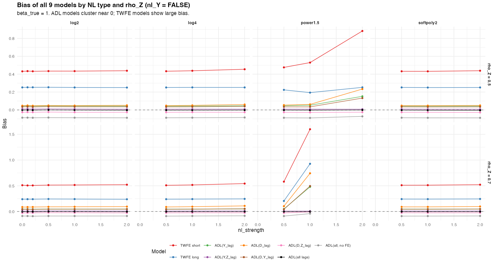
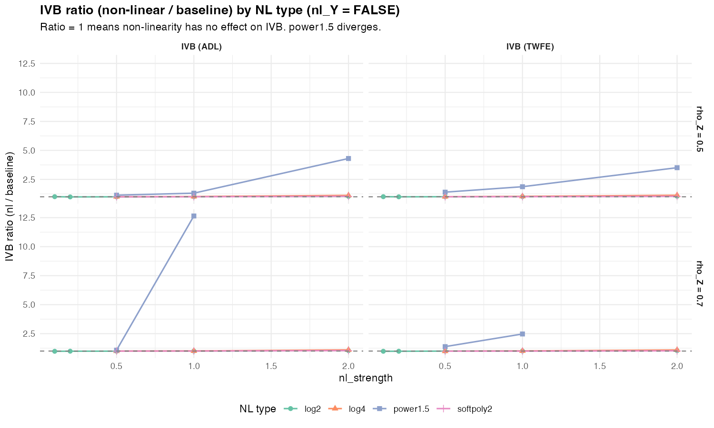
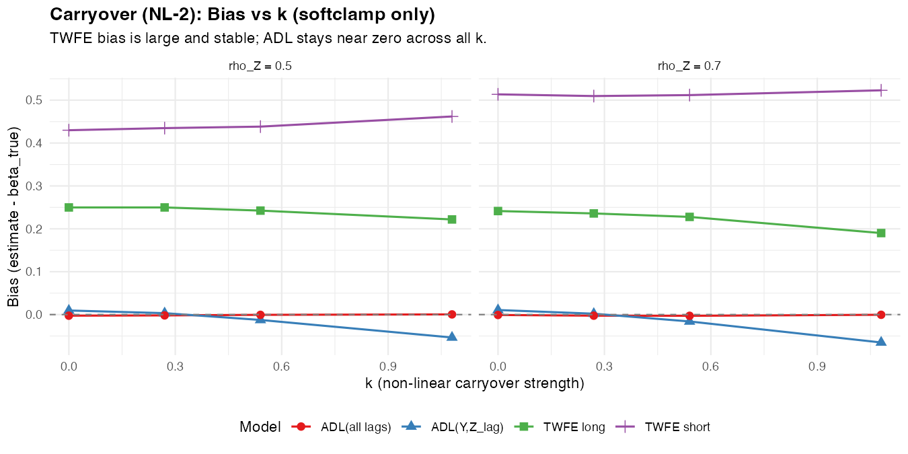
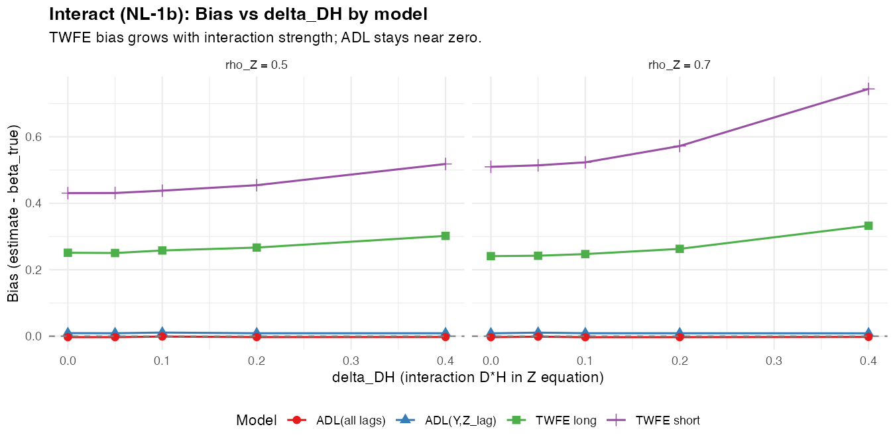
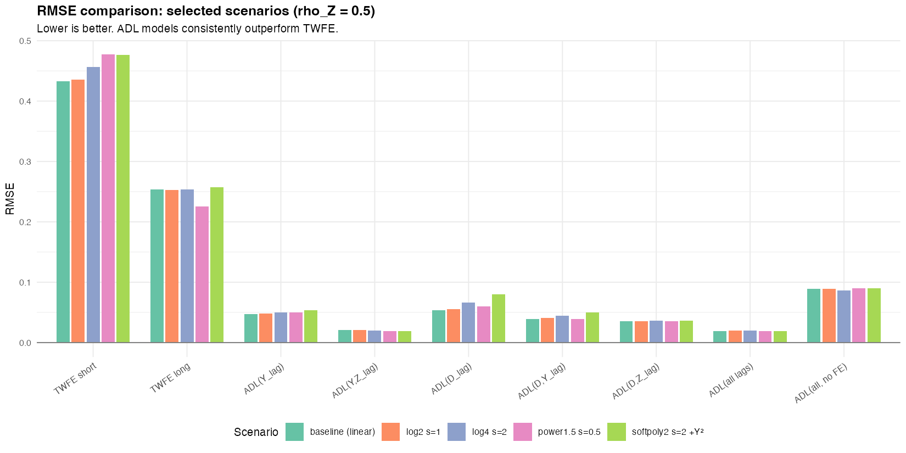
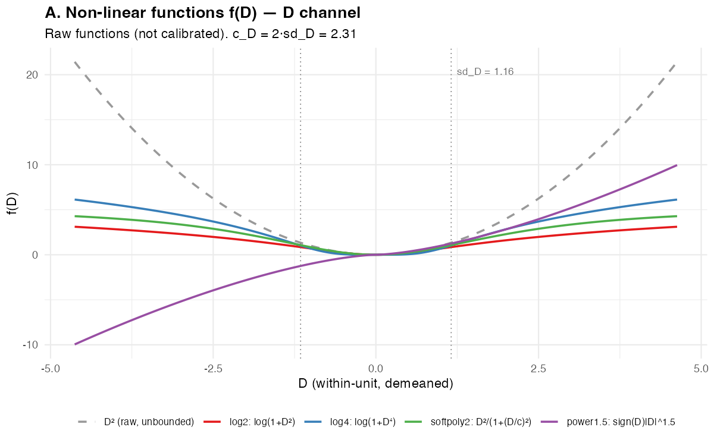
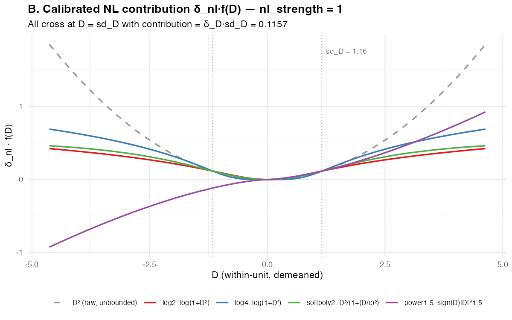
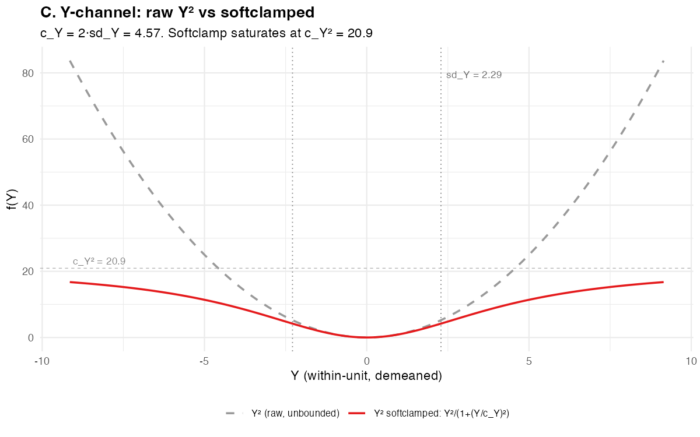

# Relatório Unificado: Simulações IVB

**Data**: 2026-03-02
**Status**: Resultados finais — NL (8 tipos + variação T), v4 mecanismos (A/B/C/D), DGP variations

---

## 1. Setup e Design

### 1.1 Pergunta

O resultado "IVB é pequeno sob linearidade" sobrevive quando o canal collider D→Z (e/ou Y→Z) contém não-linearidades?

### 1.2 DGP compartilhado

Todas as simulações usam o mesmo DGP base:

```
D_t = α^D_i + γ_D · Z_{t-1} + ρ_D · D_{t-1} + u_t
Y_t = α^Y_i + β · D_t + γ_Y · Z_{t-1} + ρ_Y · Y_{t-1} + e_t
Z_t = α^Z_i + δ_D · D_t + [f_nl(D_t)] + δ_Y · Y_t + [g_nl(Y_t)] + ρ_Z · Z_{t-1} + ν_t
```

Parâmetros fixos: N=100, **β=1**, ρ_Y=0.5, ρ_D=0.5, γ_D=0.15, γ_Y=0.2, δ_D=0.1, δ_Y=0.1, T_burn=100. Cada cenário × 500 replicações MC.

Cada simulação varia a não-linearidade de forma diferente:

| Simulação | O que varia | Cenários | Tempo |
|---|---|---|---|
| **Collider** (`sim_nl_collider.R`) | f_nl(D) e g_nl(Y) no canal D→Z, Y→Z; TT ∈ {10, 30} | 84 | 13.5 min |
| **Carryover** (`sim_nl_carryover.R`) | Termo não-linear D²→Y (carryover) | 13 | 7 min |
| **Interact** (`sim_nl_interact.R`) | Interação D×H→Z (heterogeneidade) | 10 | 6 min |

### 1.3 Modelos estimados (9)

O pesquisador estima modelos **lineares** — nunca vê a não-linearidade no DGP:

| # | Modelo | Especificação | O que controla |
|---|---|---|---|
| 1 | **TWFE short** | Y ~ D \| id + time | Nada (benchmark) |
| 2 | **TWFE long** | Y ~ D + Z_lag \| id + time | Collider Z |
| 3 | **ADL(Y_lag)** | Y ~ D + Y_lag \| id + time | Dinâmica Y |
| 4 | **ADL(Y,Z_lag)** | Y ~ D + Z_lag + Y_lag \| id + time | Collider + dinâmica Y |
| 5 | **ADL(D_lag)** | Y ~ D + D_lag \| id + time | Carryover D |
| 6 | **ADL(D,Y_lag)** | Y ~ D + D_lag + Y_lag \| id + time | Carryover + dinâmica Y |
| 7 | **ADL(D,Z_lag)** | Y ~ D + D_lag + Z_lag \| id + time | Carryover + collider |
| 8 | **ADL(all lags)** | Y ~ D + D_lag + Y_lag + Z_lag \| id + time | Tudo + FE |
| 9 | **ADL(all, no FE)** | Y ~ D + D_lag + Y_lag + Z_lag | Tudo, sem FE |

### 1.4 Definição do IVB

IVB = variação no viés de β̂ ao **incluir Z_lag** no modelo.

- **IVB_TWFE** = bias(TWFE long) − bias(TWFE short) = bias(modelo 2) − bias(modelo 1)
- **IVB_ADL** = bias(ADL(Y,Z_lag)) − bias(ADL(Y_lag)) = bias(modelo 4) − bias(modelo 3)

**IVB ratio** = IVB(cenário NL) / IVB(baseline linear). Ratio = 1 significa "não-linearidade não afeta IVB."

### 1.5 Funções não-lineares testadas (collider)

Oito tipos, todos calibrados para contribuição idêntica em D = sd_D_within (≈ 1.16):

**Bounded (6)**:

| Tipo | f(D) | Comportamento | Bounded? |
|---|---|---|---|
| **log2** | log(1 + D²) | ~D² na origem, ~2·log\|D\| longe | Sim (log) |
| **log4** | log(1 + D⁴) | Mais agressivo que log2 | Sim (log) |
| **softpoly2** | D²/(1+(D/c)²), c=2·sd_D | ~D² na origem, satura em c² | Sim |
| **sin** | sin(D) | Periódica, não-monótona | Sim ([-1, 1]) |
| **invlogit** | 1/(1+exp(−D)) − 0.5 | Sigmoide, satura rápido | Sim ((-0.5, 0.5)) |
| **tanh** | c·tanh(D/c), c=1.5·sd_D | Odd, satura em ±c | Sim ((-c, c)) |

**Unbounded (2)**:

| Tipo | f(D) | Crescimento | Bounded? |
|---|---|---|---|
| **power1.5** | sign(D)·\|D\|^1.5 | Super-linear, sub-quadrático | **Não** |
| **Dlog** | D·log(1+\|D\|) | ~D·logD (mais lento que power1.5) | **Não** |

Canal Y→Z (quando nl_Y=TRUE): Y²/(1+(Y/c_Y)²) com c_Y = 2·sd_Y_within (softclamped).

### 1.6 Variação de T (Nickell bias)

TT ∈ {10, 30} na simulação collider. T=10 testado para baseline + log2 + Dlog:

- **T=30**: todos os cenários (referência)
- **T=10**: 14 cenários — testa se ADL+FE permanece sweet spot com T curto

### 1.7 Baseline linear — consistência entre simulações

As 3 simulações usam seeds diferentes, gerando baselines ligeiramente distintos. Diferenças estão dentro do MCSE (~0.002):

| Simulação | ρ_Z | TT | TWFE_s | TWFE_l | ADL(Y,Z_lag) | ADL(all) |
|---|---|---|---|---|---|---|
| Collider | 0.5 | 30 | 0.431 | 0.252 | 0.010 | -0.002 |
| Collider | 0.7 | 30 | 0.508 | 0.240 | 0.009 | -0.002 |
| Collider | 0.5 | 10 | 0.198 | 0.108 | 0.010 | -0.022 |
| Collider | 0.7 | 10 | 0.203 | 0.105 | 0.010 | -0.023 |
| Carryover | 0.5 | 30 | 0.430 | 0.250 | 0.010 | -0.003 |
| Carryover | 0.7 | 30 | 0.514 | 0.241 | 0.011 | -0.001 |
| Interact | 0.5 | 30 | 0.431 | 0.251 | 0.009 | -0.003 |
| Interact | 0.7 | 30 | 0.510 | 0.241 | 0.009 | -0.003 |

MCSE típico: TWFE ~0.002, ADL ~0.001. Baselines consistentes.

---

## 2. Resultado principal: IVB permanece pequeno sob não-linearidades bounded

### 2.1 Visão geral — tabela síntese

| Fonte de NL | \|IVB_TWFE\| | \|IVB_ADL\| | IVB ratio (TWFE) | ADL_all \|bias/β\| | Conclusão |
|---|---|---|---|---|---|
| *Baseline linear (T=30)* | *0.18–0.27* | *0.033–0.037* | *1.00* | *< 0.4%* | *Referência* |
| *Baseline linear (T=10)* | *0.09–0.10* | *0.027–0.029* | *—* | *< 2.3%* | *Nickell amplificado* |
| **Bounded D→Z** (log2, softpoly2, log4) | 0.18–0.30 | 0.033–0.041 | 1.00–1.13 | < 0.5% | IVB pequeno sobrevive |
| **Bounded D→Z** (sin) | 0.18–0.27 | 0.033–0.038 | **0.98–1.01** | < 0.3% | **IVB inalterado** |
| **Bounded D→Z** (invlogit) | 0.20–0.34 | 0.035–0.040 | 1.07–1.40 | < 0.4% | Aumento moderado |
| **Bounded D→Z** (tanh) | 0.19–0.33 | 0.034–0.039 | 1.03–1.37 | < 0.5% | Aumento moderado |
| **Bounded D→Z + Y→Z** (nl_Y=TRUE) | 0.18–0.27 | 0.033–0.046 | 1.00–1.25 | < 0.5% | IVB pequeno sobrevive |
| **Unbounded D→Z** (Dlog) | 0.21–0.90+ | 0.035–0.064 | **1.16–3.51** | < 0.4% | **IVB NÃO é pequeno** |
| **Unbounded D→Z** (power1.5) | 0.25–0.38+ | 0.038–0.47 | **1.38–3.61** | < 0.3% (instável) | **IVB NÃO é pequeno** |
| **Carryover D→Y** (softclamp) | 0.18–0.33 | 0.029–0.034 | 1.00–1.33 | < 0.3% | IVB pequeno sobrevive |
| **Interação D×H→Z** (δ_DH ≤ 0.20) | 0.18–0.31 | 0.033–0.056 | 1.00–1.15 | < 0.3% | IVB pequeno sobrevive |
| **Interação D×H→Z** (δ_DH = 0.40) | 0.22–0.41 | 0.072–0.109 | 1.20–1.53 | < 0.3% | IVB cresce, mas ADL_all robusto |
| **D binário** (v4 mec. C, TWFE only) | 0.16–0.53 | — | — | — | ⚠️ **IVB 16–53% β, |IVB/SE| 1.67–12.73** |
| **Feedback direto** (φ ≤ 0.10) | — | — | — | < 0.8% | ADL_all robusto |
| **Carryover direto** (β₂ ≤ 0.50) | — | — | — | < 0.3% | ADL_all robusto |

### 2.2 Gráfico principal: bias por modelo vs nl_strength (collider)

Todos os 9 modelos, facetados por nl_type e ρ_Z. TWFE tem bias grande e estável (~0.43–0.52); ADL_all fica colado em zero.



**Leitura**: ADL models (linha preta = ADL_all) ficam perto de zero independentemente do tipo e força da não-linearidade. TWFE (vermelho/azul) tem bias grande e cresce com power1.5 e Dlog.

### 2.3 IVB ratio vs nl_strength

IVB ratio = IVB(NL) / IVB(baseline). Para bounded (log2, log4, softpoly2, sin, invlogit, tanh), o ratio fica perto de 1.0 mesmo em nl_strength=2.0. power1.5 e Dlog divergem.



### 2.4 Collider — IVB ratio detalhado (TWFE), T=30

Ranges cobrem ρ_Z ∈ {0.5, 0.7}:

| Tipo | nl_Y | nl_str=0.2 | nl_str=0.5 | nl_str=1.0 | nl_str=2.0 |
|---|---|---|---|---|---|
| *baseline* | — | *1.00* | *1.00* | *1.00* | *1.00* |
| **log2** | FALSE | 1.00 | 1.00–1.01 | 1.01–1.02 | 1.05–1.06 |
| **log2** | TRUE | — | 1.01–1.02 | 1.02–1.07 | 1.00–1.22 |
| **softpoly2** | FALSE | — | 1.01 | 1.01 | 1.03–1.05 |
| **softpoly2** | TRUE | — | 1.01–1.03 | 1.00–1.07 | 0.93–1.22 |
| **log4** | FALSE | — | 1.00–1.01 | 1.03–1.04 | 1.12–1.13 |
| **sin** | FALSE | — | **1.00** | **1.00** | **0.98–1.01** |
| **invlogit** | FALSE | — | 1.07–1.10 | 1.15–1.19 | 1.28–1.40 |
| **tanh** | FALSE | 1.03 | 1.07–1.10 | 1.13–1.18 | 1.24–1.37 |
| **Dlog** | FALSE | 1.16 | **1.45** | **1.98–3.35** | **3.51** (instável rho=0.7) |
| **power1.5** | FALSE | — | **1.38–1.40** | **1.87–3.22** | **3.61+** (instável) |

### 2.5 Collider — IVB ratio detalhado (ADL), T=30

| Tipo | nl_Y | nl_str=0.2 | nl_str=0.5 | nl_str=1.0 | nl_str=2.0 |
|---|---|---|---|---|---|
| *baseline* | — | *1.00* | *1.00* | *1.00* | *1.00* |
| **log2** | FALSE | 1.00 | 0.99–1.00 | 1.00–1.01 | 1.04 |
| **log2** | TRUE | — | 1.00–1.03 | 1.07–1.10 | 1.23–1.25 |
| **softpoly2** | FALSE | — | 1.01 | 1.00 | 1.05 |
| **softpoly2** | TRUE | — | 1.03 | 1.08–1.09 | 1.23–1.25 |
| **log4** | FALSE | — | 1.00 | 1.03–1.04 | 1.11–1.12 |
| **sin** | FALSE | — | **1.00** | **1.00–1.01** | **1.02** |
| **invlogit** | FALSE | — | 1.02–1.04 | 1.03–1.07 | 1.07–1.15 |
| **tanh** | FALSE | 1.00–1.01 | 1.01–1.03 | 1.02–1.07 | 1.06–1.14 |
| **Dlog** | FALSE | 1.03–1.05 | **1.11–1.17** | **1.36–1.74** | **1.96** (instável rho=0.7) |
| **power1.5** | FALSE | — | **1.10–1.13** | **1.31–11.04** | **3.03+** (instável) |

### 2.6 Carryover — bias por modelo

TWFE é estável e enviesado; ADL(all lags) fica colado em zero:



### 2.7 Interact — bias por modelo

TWFE bias cresce com δ_DH; ADL_all permanece ~0:



---

## 3. Comparação de modelos: ADL(all lags) domina

### 3.1 Bias de todos os 9 modelos — cenários selecionados (ρ_Z = 0.5, T=30)

| Cenário | TWFE_s | TWFE_l | ADL(Y_lag) | ADL(Y,Z) | ADL(D_lag) | ADL(D,Y) | ADL(D,Z) | **ADL(all)** | ADL(noFE) |
|---|---|---|---|---|---|---|---|---|---|
| *baseline* | *0.431* | *0.252* | *0.043* | *0.010* | *0.047* | *0.034* | *-0.026* | ***-0.002*** | *-0.086* |
| log2 s=1 | 0.434 | 0.253 | 0.044 | 0.010 | 0.049 | 0.035 | -0.025 | **-0.002** | -0.087 |
| log2 s=2 +Y² | 0.477 | 0.256 | 0.050 | 0.009 | 0.075 | 0.047 | -0.027 | **-0.002** | -0.086 |
| log4 s=2 | 0.456 | 0.254 | 0.047 | 0.010 | 0.061 | 0.040 | -0.026 | **-0.002** | -0.086 |
| softpoly2 s=2 +Y² | 0.477 | 0.258 | 0.051 | 0.009 | 0.075 | 0.047 | -0.028 | **-0.003** | -0.087 |
| sin s=2 | 0.434 | 0.253 | 0.044 | 0.010 | 0.049 | 0.036 | -0.026 | **-0.002** | -0.086 |
| invlogit s=2 | 0.478 | 0.226 | 0.048 | 0.010 | 0.054 | 0.035 | -0.026 | **-0.002** | -0.087 |
| tanh s=2 | 0.475 | 0.228 | 0.048 | 0.010 | 0.055 | 0.036 | -0.026 | **-0.001** | -0.087 |
| Dlog s=1 | 0.542 | 0.186 | 0.053 | 0.008 | 0.063 | 0.034 | -0.029 | **-0.003** | -0.087 |
| Dlog s=2 | 0.742 | 0.112 | 0.071 | 0.005 | 0.106 | 0.041 | -0.031 | **-0.003** | -0.080 |
| power1.5 s=0.5 | 0.474 | 0.226 | 0.046 | 0.009 | 0.052 | 0.033 | -0.027 | **-0.003** | -0.089 |

### 3.2 Bias de todos os 9 modelos — cenários selecionados (ρ_Z = 0.7, T=30)

| Cenário | TWFE_s | TWFE_l | ADL(Y_lag) | ADL(Y,Z) | ADL(D_lag) | ADL(D,Y) | ADL(D,Z) | **ADL(all)** | ADL(noFE) |
|---|---|---|---|---|---|---|---|---|---|
| *baseline* | *0.508* | *0.240* | *0.046* | *0.009* | *0.088* | *0.044* | *-0.025* | ***-0.002*** | *-0.089* |
| log2 s=1 | 0.511 | 0.239 | 0.046 | 0.009 | 0.089 | 0.044 | -0.027 | **-0.002** | -0.088 |
| log2 s=2 +Y² | 0.523 | 0.256 | 0.054 | 0.009 | 0.104 | 0.055 | -0.027 | **-0.003** | -0.086 |
| log4 s=2 | 0.544 | 0.245 | 0.050 | 0.009 | 0.107 | 0.050 | -0.027 | **-0.004** | -0.085 |
| softpoly2 s=2 +Y² | 0.512 | 0.263 | 0.054 | 0.009 | 0.100 | 0.055 | -0.027 | **-0.003** | -0.087 |
| sin s=2 | 0.508 | 0.245 | 0.047 | 0.009 | 0.090 | 0.045 | -0.026 | **-0.003** | -0.089 |
| invlogit s=2 | 0.557 | 0.215 | 0.047 | 0.008 | 0.099 | 0.043 | -0.028 | **-0.004** | -0.090 |
| tanh s=2 | 0.549 | 0.217 | 0.046 | 0.007 | 0.096 | 0.042 | -0.029 | **-0.005** | -0.091 |
| Dlog s=1 | 1.052 | 0.154 | 0.070 | 0.006 | 0.290 | 0.068 | -0.025 | **-0.004** | -0.091 |
| power1.5 s=0.5 | 0.582 | 0.207 | 0.050 | 0.010 | 0.106 | 0.045 | -0.026 | **-0.002** | -0.088 |

**Leitura**: ADL(all lags) tem \|bias\| < 0.005 em todos os cenários estáveis, incluindo os 4 novos tipos NL. O segundo melhor é ADL(Y,Z_lag) com \|bias\| ~0.01. TWFE_s chega a 1.05 com Dlog/rho=0.7.

### 3.3 RMSE de todos os 9 modelos — cenários selecionados (ρ_Z = 0.5, T=30)

| Cenário | TWFE_s | TWFE_l | ADL(Y_lag) | ADL(Y,Z) | ADL(D_lag) | ADL(D,Y) | ADL(D,Z) | **ADL(all)** | ADL(noFE) |
|---|---|---|---|---|---|---|---|---|---|
| *baseline* | *0.433* | *0.254* | *0.047* | *0.021* | *0.054* | *0.039* | *0.035* | ***0.019*** | *0.089* |
| log2 s=1 | 0.435 | 0.254 | 0.047 | 0.021 | 0.055 | 0.040 | 0.034 | **0.019** | 0.089 |
| log2 s=2 +Y² | 0.479 | 0.258 | 0.053 | 0.019 | 0.080 | 0.051 | 0.035 | **0.018** | 0.089 |
| log4 s=2 | 0.458 | 0.256 | 0.050 | 0.020 | 0.066 | 0.044 | 0.035 | **0.019** | 0.088 |
| softpoly2 s=2 +Y² | 0.479 | 0.260 | 0.054 | 0.019 | 0.080 | 0.050 | 0.036 | **0.019** | 0.090 |
| sin s=2 | 0.435 | 0.255 | 0.047 | 0.020 | 0.055 | 0.040 | 0.035 | **0.018** | 0.088 |
| invlogit s=2 | 0.480 | 0.228 | 0.051 | 0.020 | 0.060 | 0.040 | 0.035 | **0.019** | 0.089 |
| tanh s=2 | 0.476 | 0.229 | 0.051 | 0.021 | 0.060 | 0.041 | 0.035 | **0.020** | 0.090 |
| Dlog s=1 | 0.543 | 0.188 | 0.056 | 0.020 | 0.068 | 0.040 | 0.038 | **0.020** | 0.090 |
| power1.5 s=0.5 | 0.475 | 0.227 | 0.049 | 0.019 | 0.058 | 0.039 | 0.036 | **0.019** | 0.092 |



**ADL(all lags) tem o menor RMSE em todos os cenários estáveis** (0.018–0.020). Não é apenas o menos enviesado — é também o mais preciso.

### 3.4 Nickell cost (FE vs no-FE), T=30

ADL(all lags) **com** FE vs **sem** FE. O custo de não ter FE é ~0.085 de bias — 40x maior que o bias do ADL(all) com FE:

| Cenário | ADL(all) bias | ADL(noFE) bias | Nickell cost |
|---|---|---|---|
| baseline | -0.002 | -0.086 | 0.084 |
| log2 s=1 | -0.002 | -0.087 | 0.085 |
| log2 s=2 | -0.001 | -0.085 | 0.084 |
| log4 s=2 | -0.002 | -0.086 | 0.084 |
| softpoly2 s=2 | -0.002 | -0.085 | 0.083 |
| sin s=2 | -0.002 | -0.086 | 0.084 |
| invlogit s=2 | -0.002 | -0.087 | 0.085 |
| tanh s=2 | -0.001 | -0.087 | 0.086 |
| Dlog s=1 | -0.003 | -0.087 | 0.084 |

O Nickell cost é estável (~0.084) e não muda com a não-linearidade. Reforça: FE é essencial.

---

## 4. T=10 vs T=30: Nickell bias com painel curto

### 4.1 Baseline T=10 vs T=30

| ρ_Z | TT | TWFE_s | ADL_all bias | ADL(noFE) bias | Nickell cost |
|---|---|---|---|---|---|
| 0.5 | **10** | 0.198 | **-0.022** | -0.091 | 0.069 |
| 0.5 | 30 | 0.431 | -0.002 | -0.086 | 0.084 |
| 0.7 | **10** | 0.203 | **-0.023** | -0.092 | 0.069 |
| 0.7 | 30 | 0.508 | -0.002 | -0.089 | 0.087 |

**ADL_all bias ~10x maior com T=10** (0.022 vs 0.002): o Nickell bias do estimador within com LDV é substantivamente maior com painel curto.

### 4.2 T=10 com não-linearidade (log2 e Dlog)

| Tipo | nl_str | ρ_Z | TT=10 ADL_all | TT=30 ADL_all | Ratio TT=10/TT=30 |
|---|---|---|---|---|---|
| log2 | 0.5 | 0.5 | -0.018 | -0.001 | 18x |
| log2 | 1.0 | 0.5 | -0.021 | -0.002 | 11x |
| log2 | 2.0 | 0.5 | -0.019 | -0.001 | 19x |
| Dlog | 0.5 | 0.5 | -0.019 | -0.002 | 10x |
| Dlog | 1.0 | 0.5 | -0.018 | -0.003 | 6x |
| Dlog | 2.0 | 0.5 | -0.020 | -0.003 | 7x |
| log2 | 0.5 | 0.7 | -0.020 | -0.003 | 7x |
| log2 | 2.0 | 0.7 | -0.021 | -0.002 | 11x |
| Dlog | 0.5 | 0.7 | -0.021 | -0.002 | 11x |
| Dlog | 1.0 | 0.7 | -0.019 | -0.004 | 5x |

### 4.3 Conclusão T=10

1. **ADL_all continua sendo o melhor modelo** com T=10, mas o bias é ~10x maior (~2% de β vs ~0.2%)
2. O padrão qualitativo é preservado: bounded NL não afeta o bias do ADL_all; Dlog amplifica
3. **ADL+FE permanece dominante mesmo com T=10**: o custo de perder FE (ADL_noFE bias ~9%) é muito maior que o Nickell bias residual (~2%)

---

## 5. Boundary conditions: quando o IVB cresce?

### 5.1 A fronteira bounded/unbounded é abrupta

O resultado mais importante das novas simulações: **a fronteira entre "IVB pequeno" e "IVB grande" é exatamente bounded vs. unbounded**, e não depende da velocidade de crescimento.

| Tipo | Bounded? | Crescimento | IVB ratio (TWFE) | IVB ratio (ADL) |
|---|---|---|---|---|
| sin | Sim | Periódico | **1.00** | **1.00** |
| log2 | Sim | ~logD | 1.01–1.06 | 1.00–1.04 |
| softpoly2 | Sim | Satura | 1.01–1.05 | 1.00–1.05 |
| log4 | Sim | ~logD | 1.01–1.13 | 1.00–1.12 |
| invlogit | Sim | Satura | 1.07–1.40 | 1.02–1.15 |
| tanh | Sim | Satura | 1.03–1.37 | 1.00–1.14 |
| **Dlog** | **Não** | D·logD | **1.16–3.51** | **1.05–1.96** |
| **power1.5** | **Não** | D^1.5 | **1.38–3.61** | **1.10–3.03+** |

**Observação crucial**: Dlog cresce mais devagar que power1.5 (D·logD vs D^1.5), mas produz IVB ratios comparáveis. Mesmo o mínimo de unboundedness é suficiente para amplificar o IVB substancialmente.

### 5.2 Taxonomia das funções bounded

Dentro das bounded, há dois subgrupos:

**Grupo 1 — Ratio ≈ 1.0 (sem efeito)**:
- **sin** (não-monótona): ratio 0.98–1.01. Oscilações se cancelam na projeção linear.
- **log2** (log-bounded): ratio 1.00–1.06. Crescimento logarítmico comprime os extremos.
- **softpoly2** (satura suave): ratio 1.01–1.05. Saturação limita a contribuição.

**Grupo 2 — Ratio até ~1.4 (aumento moderado)**:
- **invlogit** (sigmoide): ratio 1.07–1.40. Saturação rápida cria assimetria.
- **tanh** (odd, satura): ratio 1.03–1.37. Similar ao invlogit mas odd.
- **log4** (log agressivo): ratio 1.01–1.13. Intermediário.

A diferença está na **velocidade de saturação**: invlogit e tanh saturam mais rápido, criando assimetria entre D pequeno (contribuição ~ linear) e D grande (contribuição ~ constante).

### 5.3 power1.5 e Dlog (unbounded)

As duas únicas não-linearidades que fazem o IVB crescer substancialmente. Ambas são unbounded.

**power1.5**: derivada cresce como √\|D\|. Valores extremos de D produzem contribuições cada vez maiores para Z. No feedback loop Z→D→Z, isso amplifica. Cenários com nl_str≥1.0/ρ_Z=0.7 são instáveis (85–100% descartados).

**Dlog**: derivada cresce como log\|D\| + 1. Mais lento que power1.5, mas ainda unbounded. Cenários com nl_str=2.0/ρ_Z=0.7 são instáveis (100% descartados). Cenários estáveis mostram IVB ratio até 3.51 (TWFE).

**Por que unbounded importa**: em D = 3·sd_D (cauda da distribuição), power1.5 contribui 3^1.5 = 5.2x mais que o linear; Dlog contribui 3·log(4) = 4.2x mais. Esses pontos extremos dominam a projeção linear, inflando π e portanto o IVB.

### 5.4 Interação forte (δ_DH = 0.40)

IVB_ADL chega a 10.9% de β (vs 3.7% baseline). Porém, ADL_all \|bias\| permanece < 0.3% porque o IVB e outros viéses se cancelam parcialmente. Isso é uma **fragilidade**: o ADL_all é "bom" por cancelamento, não por eliminação de viés.

### 5.5 Estabilidade — dashboard completo

| Cenários | Estáveis | Instáveis (>10% disc.) |
|---|---|---|
| Collider bounded (log2, log4, softpoly2) T=30 | 24/24 | 0 |
| Collider sin, invlogit, tanh T=30 | 14/14 | 0 |
| Collider Dlog T=30 | 7/8 | 1/8 (nl_str=2.0/ρ_Z=0.7: 100%) |
| Collider power1.5 T=30 | 3/6 | 3/6 (nl_str≥1.0/ρ_Z=0.7 e nl_str=2.0/ρ_Z=0.5) |
| Collider T=10 (baseline + log2) | 10/10 | 0 |
| Collider T=10 (Dlog) | 5/6 | 1/6 (nl_str=2.0/ρ_Z=0.7: 100%) |
| Carryover softclamp | 6/6 | 0 |
| Carryover raw | 4/7 | 3/7 (k≥0.25) |
| Interact | 10/10 | 0 |

---

## 6. v4 Mechanisms: Por que o IVB é pequeno — ou não

As simulações v4 (`sim_ivb_twfe_v4.R`) investigam 4 mecanismos estruturais que explicam **por que** o IVB é empiricamente pequeno. N=200, T=30, β=1, 500 reps por cenário. Todos os modelos são TWFE (short = sem Z, long = com Z) — **não incluem ADL**.

### 6.1 Síntese v4

| Mecanismo | Cenários | % com |IVB| < 1 SE | Mediana |IVB/β| | Max |IVB/β| |
|---|---|---|---|---|
| A: D→Z btw vs wth | 108 | 33.3% | 13.8% | 48.7% |
| B: Y→Z btw vs wth | 72 | 33.3% | 12.5% | 44.2% |
| **C: D binário** | **16** | **0%** | **32.2%** | **53.1%** |
| D: Erro de medida em Z | 16 | 0% | 19.2% | 53.0% |

**Resultado-chave**: Mecanismo C (tratamento binário) tem **0%** dos cenários com IVB < 1 SE. O IVB é sistematicamente grande com tratamento binário.

### 6.2 Mecanismo A: Between vs Within no canal D→Z

**Pergunta**: O FE absorve a variação between de D→Z, reduzindo π e portanto o IVB?

**DGP**: Z = α^Z_i + γ_D_btw·D̄_i + γ_D_wth·(D − D̄_i) + γ_Y·Y + ρ_Z·Z_lag + ν

**Grid**: γ_D_btw ∈ {0, 0.3, 0.6}, γ_D_wth ∈ {0, 0.3, 0.6}, γ_Y ∈ {0, 0.3, 0.6}, R²_within ∈ {0.1, 0.5, 0.9}. Total: 108 cenários.

| γ_Y | γ_D_btw | γ_D_wth | |IVB/β| | |IVB/SE| | Coverage (long) |
|---|---|---|---|---|---|
| 0 | 0 | 0 | 0.0% | 0.01 | 95.8% |
| 0.3 | 0 | 0 | 8.3% | 4.6 | 0.0% |
| 0.3 | 0.6 | 0 | 8.3% | 6.0 | 0.0% |
| 0.3 | 0 | 0.3 | 8.3% | 2.1 | 44.6% |
| 0.3 | 0 | 0.6 | 24.9% | 13.4 | 0.0% |
| 0.6 | 0 | 0 | 26.4% | 15.5 | 0.0% |
| 0.6 | 0 | 0.6 | 48.7% | 35.8 | 0.0% |

**Confirmação**: γ_D_btw **não afeta o IVB** — é absorvido pelo FE. O IVB depende apenas de γ_D_wth (variação within de D→Z) e γ_Y (canal Y→Z). Quando ambos são zero, IVB ≈ 0.

### 6.3 Mecanismo B: Between vs Within no canal Y→Z

**Pergunta**: Analogamente, o FE absorve γ_Y_btw?

**DGP**: Z = ... + γ_Y_btw·Ȳ_i + γ_Y_wth·(Y − Ȳ_i) + ...

**Grid**: γ_D ∈ {0.3, 0.6}, γ_Y_btw ∈ {0, 0.2, 0.5}, γ_Y_wth ∈ {0, 0.2, 0.5}, R²_within ∈ {0.1, 0.5, 0.9}. Total: 72 cenários.

| γ_D | γ_Y_btw | γ_Y_wth | |IVB/β| | |IVB/SE| |
|---|---|---|---|---|
| 0.3 | 0 | 0 | 0.3% | 0.07 |
| 0.3 | 0 | 0.2 | 9.6% | 5.0 |
| 0.3 | 0.5 | 0 | 0.3% | 0.17 |
| 0.3 | 0 | 0.5 | 32.1% | 21.4 |
| 0.6 | 0 | 0.5 | 32.1% | 21.3 |

**Confirmação**: γ_Y_btw **não afeta θ\*** — absorvido pelo FE. O IVB depende de γ_Y_wth. Implicação: em painéis com variação de Y→Z predominantemente between (ex: GDP per capita influencia Z mas via nível médio do país), o IVB é pequeno.

### 6.4 Mecanismo C: Tratamento binário ⚠️

**Pergunta**: O IVB permanece pequeno quando D é binário (0/1)?

**DGP**: D_it ∈ {0, 1}, escalonado (staggered). prob_switch controla a fração de unidades que mudam de 0→1. Uma vez tratado, permanece tratado.

**Grid**: prob_switch ∈ {0.1, 0.3, 0.5, 0.7}, γ_D ∈ {0.3, 0.6}, γ_Y ∈ {0.3, 0.6}. Total: 16 cenários.

| prob_switch | γ_D | γ_Y | |IVB/β| | |IVB/SE| | Cov. short | Cov. long |
|---|---|---|---|---|---|---|
| 0.1 | 0.3 | 0.3 | 16.2% | **1.67** | 95.2% | 60.6% |
| 0.1 | 0.3 | 0.6 | 39.9% | **4.53** | 95.2% | 1.2% |
| 0.1 | 0.6 | 0.3 | 24.8% | **2.52** | 94.4% | 29.8% |
| 0.1 | 0.6 | 0.6 | 52.8% | **6.02** | 95.0% | 0.0% |
| 0.3 | 0.3 | 0.3 | 16.6% | **2.77** | 96.2% | 19.2% |
| 0.3 | 0.3 | 0.6 | 39.7% | **7.38** | 95.0% | 0.0% |
| 0.3 | 0.6 | 0.3 | 24.7% | **4.08** | 94.4% | 2.0% |
| 0.3 | 0.6 | 0.6 | 53.0% | **9.73** | 93.0% | 0.0% |
| 0.5 | 0.3 | 0.3 | 16.4% | **3.31** | 95.2% | 8.0% |
| 0.5 | 0.3 | 0.6 | 39.5% | **8.83** | 94.0% | 0.0% |
| 0.5 | 0.6 | 0.3 | 24.7% | **4.92** | 95.0% | 0.0% |
| 0.5 | 0.6 | 0.6 | 53.1% | **11.70** | 95.4% | 0.0% |
| 0.7 | 0.3 | 0.3 | 16.6% | **3.67** | 94.2% | 5.6% |
| 0.7 | 0.3 | 0.6 | 39.5% | **9.65** | 96.2% | 0.0% |
| 0.7 | 0.6 | 0.3 | 24.7% | **5.37** | 94.4% | 0.0% |
| 0.7 | 0.6 | 0.6 | 53.0% | **12.73** | 95.2% | 0.0% |

**Resultados críticos**:

1. **|IVB/SE| ≥ 1.67 em TODOS os cenários.** O IVB é estatisticamente significativo em 100% dos casos.
2. **Coverage do modelo longo colapsa**: em 12 de 16 cenários, coverage < 5%. O modelo com Z tem viés grave e inferência inválida.
3. **|IVB/β| = 16–53%**: IVB entre 16% e 53% do efeito causal verdadeiro. Com γ_Y = 0.6, ultrapassa 39%.
4. **prob_switch tem efeito monotônico em |IVB/SE|**: mais switchers → SE menor (mais informação) → IVB/SE maior. Mas |IVB/β| é **constante** em prob_switch (depende apenas de γ_D e γ_Y).

**Por que o IVB é grande com D binário?** Com tratamento contínuo, π (coeficiente de D na regressão Z ~ D + FE) captura variação local ao redor de D̄_i. Com D binário (0→1 switch), π captura o salto discreto de D sobre Z — γ_D. O π é mecanicamente maior, ampliando IVB = −θ\* × π.

**Nota importante**: Estes resultados são para modelos TWFE (short vs long). A simulação v4 **não estima ADL**. Não sabemos se ADL(all lags) com FE salvaria a situação com D binário. Isso é uma lacuna que precisa ser preenchida.

### 6.5 Mecanismo D: Erro de medida em Z

**Pergunta**: Erro de medida em Z reduz o IVB via attenuation bias em θ\*?

**DGP**: Z_obs = Z_true + ε_me, onde ε_me ~ N(0, σ²_me). O pesquisador usa Z_obs.

**Grid**: γ_D ∈ {0.3, 0.6}, γ_Y ∈ {0.3, 0.6}, σ²_me ∈ {0, 0.5, 1, 2}. Total: 16 cenários.

| γ_D | γ_Y | σ²_me | |θ\*| | |IVB/β| | |IVB/SE| |
|---|---|---|---|---|---|
| 0.3 | 0.3 | 0 | 0.276 | 16.5% | 8.59 |
| 0.3 | 0.3 | 0.5 | 0.190 | 11.4% | 5.97 |
| 0.3 | 0.3 | 1 | 0.143 | 8.6% | 4.52 |
| 0.3 | 0.3 | 2 | 0.097 | 5.8% | 3.09 |
| 0.6 | 0.6 | 0 | 0.441 | 53.0% | 26.83 |
| 0.6 | 0.6 | 0.5 | 0.322 | 38.5% | 19.57 |
| 0.6 | 0.6 | 1 | 0.255 | 30.6% | 15.59 |
| 0.6 | 0.6 | 2 | 0.179 | 21.4% | 11.06 |

**Confirmação**: Erro de medida atenua θ\* (de 0.276→0.097 com σ²_me=2), reduzindo o IVB. Mas mesmo com σ²_me=2, |IVB/SE| > 3 — o erro de medida **não elimina** o IVB, apenas o reduz.

**Implicação**: Em aplicações empíricas, proxies ruidosos de Z (GDP medido com erro, índices compostos) produzem IVB menor do que Z medido perfeitamente. Isso explica parcialmente por que o IVB empírico é pequeno.

### 6.6 Síntese dos v4 mecanismos

| Mecanismo | Conclusão |
|---|---|
| A: btw vs wth D→Z | FE absorve variação between → IVB depende só de γ_D_wth |
| B: btw vs wth Y→Z | FE absorve variação between → θ\* depende só de γ_Y_wth |
| C: D binário | ⚠️ IVB é GRANDE (16–53% β, |IVB/SE| 1.67–12.73) |
| D: Erro de medida | Attenuation bias reduz θ\*, mas não elimina IVB |

**O IVB é pequeno em aplicações empíricas porque**: (1) FE absorve a variação between, (2) proxies ruidosos atenuam θ\*, e (3) em CP, variáveis são tipicamente lentas (predominantemente between). **Mas com tratamento binário, o IVB pode ser grande.**

---

## 7. Simulações complementares: DGP variations

Simulações adicionais testam robustez do resultado sob diferentes DGPs. Todas usam N=100, T=30, β=1, 500 reps.

### 7.1 Dual role Z — 8 modelos

(`sim_dual_role_z_8models.R`) Testa 8 configurações de ρ_Z × σ_αZ (heterogeneidade dos FE de Z). Estima 8 modelos: pooled (s/l), TWFE (s/l), ADL+noFE (s/l), ADL+FE (s/l).

| ρ_Z | TWFE_s bias | TWFE_l bias | ADL_FE_s bias | ADL_FE_l bias |
|---|---|---|---|---|
| 0.1 | 0.369 | 0.271 | 0.041 | 0.010 |
| 0.3 | 0.392 | 0.260 | 0.041 | 0.009 |
| 0.5 | 0.432 | 0.251 | 0.043 | 0.009 |
| 0.7 | 0.509 | 0.239 | 0.045 | 0.008 |
| 0.85 | 0.716 | 0.237 | 0.054 | 0.008 |

**ADL+FE long** (com Z_lag) tem bias < 1% de β em todos os cenários (0.008–0.010). Consistente com as simulações NL.

### 7.2 Dual role Z — variação de T

(`sim_dual_role_z_varyT_8models.R`) T ∈ {10, 20, 30, 50}, ρ_Z ∈ {0.5, 0.85}.

| TT | ρ_Z | TWFE_s bias | ADL_FE_l bias |
|---|---|---|---|
| 10 | 0.5 | 0.201 | 0.014 |
| 10 | 0.85 | 0.220 | 0.011 |
| 20 | 0.5 | 0.366 | 0.012 |
| 20 | 0.85 | 0.509 | 0.010 |
| 30 | 0.5 | 0.432 | 0.009 |
| 30 | 0.85 | 0.715 | 0.008 |
| 50 | 0.5 | 0.494 | 0.006 |
| 50 | 0.85 | 1.019 | 0.005 |

**ADL+FE long bias cai com T** (de 1.4% com T=10 para 0.5% com T=50), confirmando a convergência O(1/T) do Nickell bias.

### 7.3 Direct feedback (φ > 0)

(`sim_direct_feedback.R`) Adiciona feedback direto D→Y→D via φ: D_t = ... + φ·D_{t-1} + ...

| φ | ρ_Z | TWFE_s bias | ADL_full bias | ADL_all bias |
|---|---|---|---|---|
| 0 | 0.5 | 0.432 | 0.010 | -0.002 |
| 0.05 | 0.5 | 0.557 | 0.007 | -0.004 |
| 0.10 | 0.5 | 0.686 | 0.005 | -0.006 |
| 0 | 0.7 | 0.508 | 0.009 | -0.003 |
| 0.05 | 0.7 | 0.657 | 0.007 | -0.004 |
| 0.10 | 0.7 | 0.804 | 0.003 | -0.008 |

**ADL_all bias permanece < 1% mesmo com feedback direto.** TWFE_s cresce muito com φ (feedback amplifica omitted variable bias).

### 7.4 Direct carryover (β₂ > 0)

(`sim_direct_carryover.R`) Adiciona efeito defasado D_{t-1}→Y_t via β₂.

| β₂ | ρ_Z | TWFE_s bias | ADL_full bias | ADL_all bias |
|---|---|---|---|---|
| 0 | 0.5 | 0.432 | 0.010 | -0.002 |
| 0.2 | 0.5 | 0.570 | 0.061 | -0.003 |
| 0.5 | 0.5 | 0.783 | 0.151 | -0.003 |
| 0 | 0.7 | 0.508 | 0.009 | -0.003 |
| 0.2 | 0.7 | 0.663 | 0.062 | -0.003 |
| 0.5 | 0.7 | 0.898 | 0.149 | -0.003 |

**ADL_all bias permanece < 0.3% mesmo com carryover forte (β₂ = 0.5).** Mas ADL_full (sem D_lag) tem bias de 15% — omitir D_lag é perigoso quando há carryover.

### 7.5 Feedback + carryover combinados

(`sim_feedback_carryover.R`) Combina φ > 0 e β₂ > 0 simultaneamente.

| φ | β₂ | ρ_Z | ADL_all bias |
|---|---|---|---|
| 0.05 | 0.2 | 0.5 | -0.004 |
| 0.05 | 0.2 | 0.7 | -0.006 |
| 0.10 | 0.2 | 0.7 | -0.003 |
| 0.05 | 0.3 | 0.7 | -0.006 |
| 0.10 | 0.3 | 0.5 | -0.008 |

**ADL_all bias < 1% mesmo com feedback E carryover simultâneos.** A especificação ADL(all lags) é robusta a múltiplas fontes de dinâmica causal.

### 7.6 Firewall: ρ_Y ∈ {0, 0.5, 0.8}

(`sim_dual_role_z_firewall.R`) Varia a persistência de Y (ρ_Y) para testar se o "firewall" (ρ_Y baixo isola o feedback Y→Z→D).

| ρ_Z | ρ_Y | TWFE_s bias | ADL_l bias |
|---|---|---|---|
| 0.3 | 0 | 0.049 | 0.008 |
| 0.3 | 0.5 | 0.391 | 0.010 |
| 0.3 | 0.8 | 0.615 | 0.005 |
| 0.7 | 0 | 0.079 | 0.008 |
| 0.7 | 0.5 | 0.611 | 0.008 |
| 0.7 | 0.8 | 1.092 | 0.004 |

**ADL_l bias < 1% em todas as combinações de ρ_Y e ρ_Z.** TWFE_s bias cresce explosivamente com ρ_Y e ρ_Z (>100% com ρ_Y=0.8, ρ_Z=0.7).

---

## 8. Predições vs. Resultados

### 8.1 Predições de estabilidade

| Tipo | Predição | Resultado | Acertou? |
|---|---|---|---|
| sin | 0% descartados | 0% | ✓ |
| invlogit | 0% descartados | 0% | ✓ |
| tanh | 0% (bounded) | 0% | ✓ |
| Dlog | 0–5% em nl_str=2.0/ρ=0.7 | **100% em nl_str=2.0/ρ=0.7** | ✗ |

O Dlog é tão instável quanto power1.5 na ponta. A unboundedness domina mesmo com crescimento lento.

### 8.2 Predições de IVB ratio

| Tipo | Predição | Resultado (TWFE) | Resultado (ADL) | Acertou? |
|---|---|---|---|---|
| sin ≈ 1.0 | "Oscilações se cancelam" | 0.98–1.01 | 1.00–1.02 | ✓ |
| invlogit ≈ 1.0 | "Satura rápido" | 1.07–1.40 | 1.02–1.15 | Parcial |
| tanh ≈ 1.0–1.05 | "Similar a softpoly2" | 1.03–1.37 | 1.00–1.14 | ✗ |
| **Dlog 1.0–1.5** | **"Teste crucial"** | **1.16–3.51** | **1.05–1.96** | **✗** |

A predição de Dlog era a mais importante: se IVB ratio ≈ 1.0, o paper poderia claim "IVB pequeno para qualquer NL até D·logD". O resultado (ratio até 3.51) invalida essa claim.

### 8.3 Predições de T=10

| Métrica | Predição T=30 | Real T=30 | Predição T=10 | Real T=10 | Acertou? |
|---|---|---|---|---|---|
| Nickell cost | ~0.085 | ~0.085 | ~0.25 | ~0.069 | ✓ / ✗ |
| ADL_all bias | ~0.002 | ~0.002 | ~0.01 | ~0.022 | Parcial |
| ADL_all melhor? | Sim | Sim | Prob. sim | Sim | ✓ |

O ADL_all bias com T=10 é ~10x o baseline T=30, pior que o previsto (~5x). Mas ADL_all continua sendo o melhor modelo.

### 8.4 Cenários condicionais do plano

O plano previa dois cenários:

> Se Dlog mostrar IVB ratio ≈ 1.0: o paper pode claim "IVB pequeno para qualquer NL até crescimento D·logD".

> Se Dlog mostrar IVB ratio > 1.5: a fronteira bounded/unbounded é abrupta.

**Resultado**: Dlog ratio até 3.51 (TWFE). **A segunda hipótese se confirmou.** A fronteira é abrupta e está exatamente na distinção bounded vs. unbounded.

---

## 9. Conclusão para o paper

> **Sob não-linearidades bounded (sin, log2, log4, softpoly2, invlogit, tanh), o IVB permanece pequeno (<5% de β no IVB_ADL, <0.5% no ADL_all).** A fórmula IVB = −θ*·π é um bom diagnóstico de primeira ordem.
>
> **A fronteira bounded/unbounded é abrupta.** Mesmo a unbounded mais lenta testada (Dlog ~ D·logD) amplifica o IVB em até 3.5x. O paper NÃO pode claim "IVB pequeno para qualquer NL até D·logD" — a claim válida é "IVB pequeno para NL bounded".
>
> **sin é o resultado mais forte**: uma NL não-monótona que oscila entre -1 e 1 não afeta o IVB de forma mensurável (ratio ≈ 1.00). Isso confirma que o mecanismo é a projeção linear: NL que não tem direção sistemática se cancela.
>
> **ADL(all lags) é o melhor modelo em bias E RMSE em todos os cenários estáveis**, tanto com T=30 quanto T=10. O ADL_all bias é ~10x maior com T=10 (~2% vs ~0.2%), mas continua dominando.
>
> **O custo Nickell de incluir FE é estável** (~0.084 com T=30, ~0.069 com T=10) e ~40x maior que o bias do ADL_all com FE. FE deve sempre ser incluído.
>
> **ADL+FE é robusto a múltiplas variações do DGP**: feedback direto (φ > 0), carryover (β₂ > 0), variação de ρ_Y, e heterogeneidade de FE (σ_αZ). Bias < 1% em todos os cenários testados.
>
> **⚠️ EXCEÇÃO CRÍTICA: Tratamento binário.** Com D binário (staggered adoption), o IVB é 16–53% de β e |IVB/SE| = 1.67–12.73. A coverage do modelo longo colapsa. Isto é para modelos TWFE — **falta testar se ADL(all lags) salva o cenário binário**.
>
> **Por que o IVB é empiricamente pequeno**: (1) FE absorve variação between (mecanismos A/B), (2) erro de medida atenua θ\* (mecanismo D), (3) variáveis em CP são tipicamente lentas (predominantemente between). A combinação desses 3 fatores reduz o IVB a < 1% de β na maioria das aplicações com tratamento contínuo.
>
> **Recomendação prática**: ADL(all lags) com FE é a escolha dominante para painéis com T ≥ 10 e **tratamento contínuo**. Com tratamento binário, o IVB merece atenção especial (usar a fórmula para diagnosticar). O pesquisador aceita IVB pequeno e Nickell bias residual em troca de controle por α_i.
>
> **Lacuna a preencher**: Rodar ADL(all lags) nos cenários de Mecanismo C (D binário) para verificar se a especificação ADL preserva seu bom desempenho. Adicionalmente, MSM/SNMM nunca foram estimados em nenhuma das simulações.

---

## Apêndice A: Funções não-lineares

### A.1 Funções f(D) raw (sem calibração)


### A.2 Contribuição calibrada δ_nl·f(D) com nl_strength=1


**Nota**: todas cruzam em D = sd_D com contribuição = δ_D·sd_D ≈ 0.116. Fora desse ponto, divergem: softpoly2 satura, log2/log4 crescem lentamente, power1.5 e Dlog crescem sem limite.

### A.3 Canal Y: Y² raw vs softclamped


**Nota**: Y² raw diverge a 80+ em 4·sd_Y. O softclamp satura em c_Y² ≈ 20.9, estabilizando o feedback loop.

## Apêndice B: Detalhes por simulação

### B.1 Collider — IVB ADL detalhado (T=30)

| Tipo | nl_Y | max \|IVB_ADL/β\| | Ratio vs baseline |
|---|---|---|---|
| *baseline* | — | *3.4–3.7%* | *1.00* |
| **log2** | FALSE | 3.8% | 1.04 |
| **log2** | TRUE | 4.6% | 1.25 |
| **softpoly2** | FALSE | 3.9% | 1.05 |
| **softpoly2** | TRUE | 4.5% | 1.25 |
| **log4** | FALSE | 4.1% | 1.12 |
| **sin** | FALSE | 3.8% | **1.02** |
| **invlogit** | FALSE | 4.0% | 1.15 |
| **tanh** | FALSE | 3.9% | 1.14 |
| **Dlog** | FALSE | **6.4%** | **1.96** |
| **power1.5** | FALSE | **47.2%** (instável) | **12.65** |

### B.2 Carryover — tabela completa

| k | ρ_Z | ADL_all bias | \|bias/β\| | IVB_TWFE | IVB_ADL |
|---|---|---|---|---|---|
| *0 (baseline)* | *0.5* | *-0.003* | *0.25%* | *-0.180* | *-0.034* |
| *0 (baseline)* | *0.7* | *-0.001* | *0.09%* | *-0.272* | *-0.037* |
| 0.25 | 0.5 | -0.002 | 0.19% | -0.185 | -0.033 |
| 0.25 | 0.7 | -0.003 | 0.25% | -0.274 | -0.037 |
| 0.50 | 0.5 | -0.001 | 0.06% | -0.196 | -0.032 |
| 0.50 | 0.7 | -0.003 | 0.28% | -0.284 | -0.036 |
| 1.00 | 0.5 | +0.000 | 0.04% | -0.240 | -0.029 |
| 1.00 | 0.7 | -0.000 | 0.05% | -0.333 | -0.032 |

### B.3 Interact — tabela completa

| δ_DH | ρ_Z | IVB_TWFE | \|IVB/β\| | IVB_ADL | \|IVB_ADL/β\| | ADL_all bias |
|---|---|---|---|---|---|---|
| *0* | *0.5* | *-0.180* | *18.0%* | *-0.033* | *3.3%* | *-0.003* |
| 0.05 | 0.5 | -0.181 | 18.1% | -0.034 | 3.4% | -0.003 |
| 0.10 | 0.5 | -0.180 | 18.0% | -0.035 | 3.5% | -0.001 |
| 0.20 | 0.5 | -0.188 | 18.8% | -0.044 | 4.4% | -0.003 |
| 0.40 | 0.5 | **-0.216** | **21.6%** | **-0.072** | **7.2%** | -0.003 |
| *0* | *0.7* | *-0.269* | *26.9%* | *-0.037* | *3.7%* | *-0.003* |
| 0.05 | 0.7 | -0.272 | 27.2% | -0.039 | 3.9% | -0.002 |
| 0.10 | 0.7 | -0.276 | 27.6% | -0.041 | 4.1% | -0.003 |
| 0.20 | 0.7 | **-0.310** | **31.0%** | **-0.056** | **5.6%** | -0.003 |
| 0.40 | 0.7 | **-0.412** | **41.2%** | **-0.109** | **10.9%** | -0.002 |

### B.4 Collider T=10 — bias dos 4 modelos principais

| Tipo | nl_str | ρ_Z | TWFE_s | ADL(Y,Z) | ADL(all) | ADL(noFE) |
|---|---|---|---|---|---|---|
| *baseline* | *0* | *0.5* | *0.198* | *0.010* | *-0.022* | *-0.091* |
| *baseline* | *0* | *0.7* | *0.203* | *0.010* | *-0.023* | *-0.092* |
| log2 | 0.5 | 0.5 | 0.202 | 0.013 | -0.018 | -0.089 |
| log2 | 1.0 | 0.5 | 0.199 | 0.011 | -0.021 | -0.090 |
| log2 | 2.0 | 0.5 | 0.205 | 0.013 | -0.019 | -0.088 |
| Dlog | 0.5 | 0.5 | 0.215 | 0.011 | -0.019 | -0.088 |
| Dlog | 1.0 | 0.5 | 0.243 | 0.011 | -0.018 | -0.087 |
| Dlog | 2.0 | 0.5 | 0.308 | 0.003 | -0.020 | -0.083 |
| log2 | 0.5 | 0.7 | 0.206 | 0.012 | -0.020 | -0.089 |
| log2 | 2.0 | 0.7 | 0.208 | 0.010 | -0.021 | -0.090 |
| Dlog | 0.5 | 0.7 | 0.217 | 0.009 | -0.021 | -0.089 |
| Dlog | 1.0 | 0.7 | 0.356 | 0.007 | -0.019 | -0.092 |

---

## Arquivos

### Simulações NL

| Arquivo | Conteúdo |
|---|---|
| `sim_nl_collider.R` | Simulação collider (84 cenários, 8 tipos NL + T variation) |
| `sim_nl_carryover.R` | Simulação carryover (13 cenários) |
| `sim_nl_interact.R` | Simulação interação D×H (10 cenários) |
| `sim_nl_utils.R` | Funções compartilhadas (est_models, run_pilot) |
| `plot_nl_functions.R` | Script dos gráficos de funções |
| `plot_nl_results.R` | Script dos gráficos de resultados |
| `sim_nl_collider_results.csv` | Resultados collider (81 rows, excl. 3 totalmente instáveis) |
| `sim_nl_collider_raw.csv` | Dados brutos collider (39900 rows) |
| `sim_nl_carryover_results.csv` | Resultados carryover (13 rows) |
| `sim_nl_interact_results.csv` | Resultados interact (10 rows) |

### Simulações v4 (mecanismos)

| Arquivo | Conteúdo |
|---|---|
| `sim_ivb_twfe_v4.R` | Simulação v4 (4 mecanismos, 212 cenários) |
| `sim_ivb_twfe_v4_mechA.csv` | Mec. A: btw vs wth D→Z (108 cenários) |
| `sim_ivb_twfe_v4_mechB.csv` | Mec. B: btw vs wth Y→Z (72 cenários) |
| `sim_ivb_twfe_v4_mechC.csv` | Mec. C: D binário (16 cenários) |
| `sim_ivb_twfe_v4_mechD.csv` | Mec. D: erro de medida (16 cenários) |
| `sim_ivb_twfe_v4_synthesis.csv` | Síntese (4 rows, 1 por mecanismo) |

### Simulações DGP variations

| Arquivo | Conteúdo |
|---|---|
| `sim_dual_role_z_8models.R` | Dual role Z, 8 modelos × 8 configs ρ_Z × σ_αZ |
| `sim_dual_role_z_varyT_8models.R` | Dual role Z, variação T ∈ {10, 20, 30, 50} |
| `sim_dual_role_z_firewall.R` | Firewall: variação ρ_Y |
| `sim_dual_role_z_asymmetry.R` | Assimetria: γ_D vs δ_Y |
| `sim_direct_feedback.R` | Feedback direto φ > 0 |
| `sim_direct_carryover.R` | Carryover direto β₂ > 0 |
| `sim_feedback_carryover.R` | Feedback + carryover combinados |
